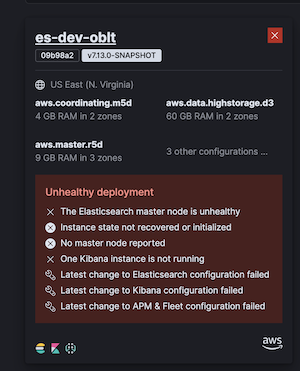
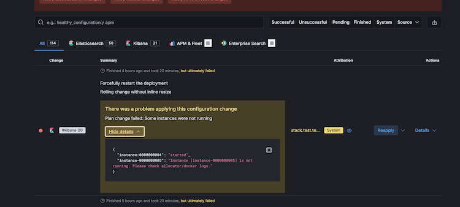
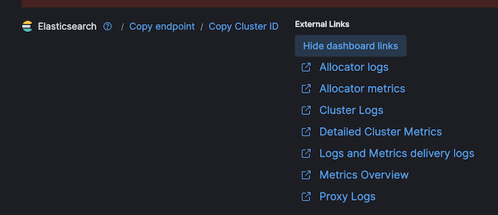
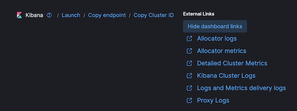
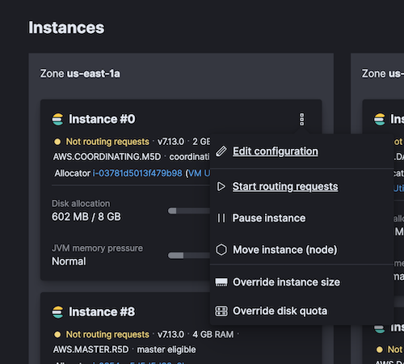
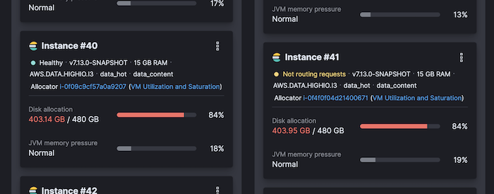
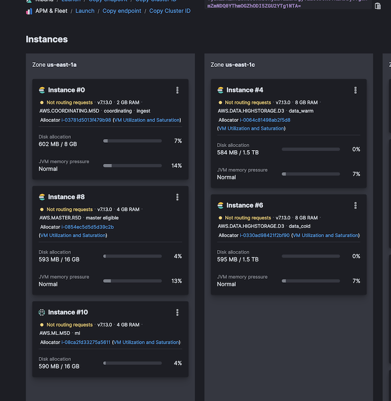
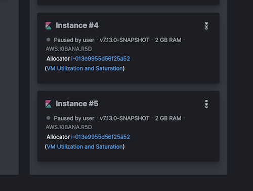

# What to do when a cluster is unhealthy

This document describes common procedures to try to resolve issues that arise when a cluster on ESS is unhealthy.
Every case is different and may not always work,
the last resource is always terminate and restore the cluster, this process takes a few hours
and is used to resolve the 80% of problems.

[Elasticsearch Troubleshooting](https://www.elastic.co/guide/en/elasticsearch/reference/current/troubleshooting.html)



## Logging in Cloud Console
Depending on the user you use to access the Cloud console you will be able to perform more or less actions on the existing deployments. Furthermore, you'll see more or less deployments depending on the user. The **admin** user will see all deployments, and the **robots** user will see only our deployments.

- To log in with the **robots** user: `gcloud secrets versions access latest --secret=elastic-cloud-observability-team-pro`

## Find unhealthy causes

First of all, we have to determine the cause of the cluster being unhealthy.
The solution will depend on the cause of the issue.
The activity logs can give us the cause of the issue in case the
latest operation over a node type failed. Each activity has details about the issue.
If we think that the cause is that activity and the error is a timeout
or other cause that can be casual we can try to retry the operation.



In the logs of Elasticsearch/Kibana/APM, we can find issues related
to the failed of the latest activity.
The most common error is related to mapping issues on .kibana index (see [Restore Kibana index](#restore_kibana_index)).





### Cluster status red

Some times the issues are related to the data, in those cases,
we check the health of the cluster and we found that the status is `red` or `yellow`.
In `red` status the Elasticsearch deployment does not ingest data,
on `yellow` status the Elasticsearch deployment is operative.

```
GET _cluster/health
```

### Unassigned shards

When the cluster is red used to mean that there are unassigned shards.
If those shards are available we can force to re-assign them
by using the `Failed Shards` `retry` button inside `Operations` option in the left menu.

> You must be logged in as Admin to see the `Operations` menu item.

```
GET _cat/shards
```


It is convenient to check the cause why those shards are unassigned,
[Cluster allocation explain API](https://www.elastic.co/guide/en/elasticsearch/reference/current/cluster-allocation-explain.html)
give us the cause details of each shard.

```
GET _cluster/allocation/explain
```

### Nodes Out of disk space

The nodes does not have infinite space because of that we have ILM policies configured.
However sometimes the ILM policies do not work or other causes make nodes hit the disk quota usage.
A temporal solution is to overwrite the disk quota temporally to allow us to operate on the cluster.



The we hit the disk quota [Index blocks](https://www.elastic.co/guide/en/elasticsearch/reference/current/index-modules-blocks.html)
are put on `read_only_allow_delete`, this means that we cannot ingest data.
There are two solutions one is to free disk space, by increasing the quota or deleting indices.
The second is to change the flag manually calling the API,
you have to keep in mind that if you hit the quota limit again the flag is set again.

```
PUT _settings
{
  "index": {
    "blocks": {
      "read_only_allow_delete": "false"
    }
  }
}
```

```
PUT INDEX_NAME/_settings
{
  "index": {
    "blocks": {
      "read_only_allow_delete": "false"
    }
  }
}
```

Another common issue after running out space is to block all indices, so it is not possible to write data

```
index [.kibana_8.0.0_001] blocked by: [FORBIDDEN/8/index write (api)];: cluster_block_exception: [cluster_block_exception] Reason: index [.kibana_8.0.0_001] blocked by: [FORBIDDEN/8/index write (api)]; (403)
```

These two API call will unblock a particular index or all indices.

```
PUT .kibana/_settings
{ "index": { "blocks": { "write": "false" } } }
```

```
PUT _all/_settings
{ "index": { "blocks": { "write": "false" } } }
```

In some cases, after deleting the indices to make some room, the aliases don't have a write index

```
{\"type\":\"illegal_argument_exception\",\"reason\":\"no write index is defined for alias [apm-8.0.0-transaction]. The write index may be explicitly disabled using is_write_index=false or the alias points to multiple indices without one being designated as a write index\"}
```

In this case, you need to make a new rollover index, to do that we have two scripts,
first try `.ci/scripts/rollover_indices.sh` and if it fails run `.ci/scripts/rollover_indices_force.sh`


In case that the cause of the high disk usage is related to the ILM policies,
we can manually move data from `hot` nodes to `warm` nodes with a few API calls.



```
PUT filebeat-*/_settings
{
    "index": {
        "routing": {
            "allocation": {
                "include": {
                    "_tier_preference" : "data_warm"
                }
            }
        }
    }
}
```

### Cluster nodes unhealthy/paused/no routing/No Master node reported/Instance state not recovered or initialized

After a plan change, restart, automatic reallocation of nodes,
and many other causes that implies changes in nodes,
can cause that nodes stay paused or stopped to routing traffic.
We have to check the logs of the activity and the deployments
to see if there is no error





In case of no errors we can use
the node drop-down menu to start the node or start routing.


If after start the node or start routing, the node is unhealthy,
we could move the node from allocator using the same drop-down.

## Restore Kibana index

To restore the `.kibana` index after a mapping issue the make the following steps:

* Backup the `.kibana_VERSION_NUMBER` indices
* Stop Kibana
* Delete the `.kibana_VERSION_NUMBER` indices
* Start Kibana
* Insert the objects in the old `.kibana_VERSION_NUMBER` index in the new `.kibana_VERSION_NUMBER` index

To make those operation we have two scripts one for the k8s deploy and another for the ESS deploys.

* Kibana running on K8s: .ci/scripts/kibana_restore.sh
* Kibana running on ESS: .ci/scripts/kibana_restore_ec.sh

NOTE:
On ESS deploy the operation to stop/start kibana do not work, so you have to make them manually.

### Filter object from the .kibana index

It is possible that after an update some of the documents in the .kibana index can cause issues.
In those cases we have to get rid of the document/s which cause the issue.
One way to make it is filtering the documents we backup in the .kibana index.
So after backup the .kibana index as we described before,
we have to make a copy and filter the object we do not want.
The following command will give us the types and number of documents of each type:

```shell
cat .kibana.data |jq '._source.type'|sort|uniq -c|sort
```

Then we can use the types names to filter the documents we do not want,
the following commands remove the `ingest-agent-policies` documents from the .kibana.data:

```shell
cp .kibana.data .kibana.data.bak
cat .kibana.data.bak |grep -v "ingest-agent-policies" > .kibana.data
```

When we end the filtering we can import the new index documents.

## Get Elasticsearch settings

To get the Elasticsearch settings we can use the following command:

```shell
GET _cluster/settings
```

```shell
GET _nodes/settings
```


## License has expired

If you see an error similar to the below one in the [monitoring cluster](../oblt-clusters/monitoring-oblt/cluster-info.md):

```
[kibana.log][ERROR] [.kibana_ingest] Action failed with 'security_exception
	Root causes:
		security_exception: current license is non-compliant for [security]'. Retrying attempt 10 in 64 seconds.
...

[elasticsearch.server][ERROR] blocking [indices:monitor/stats] operation due to expired license. Cluster health, cluster stats and indices stats
operations are blocked on license expiration. All data operations (read and write) continue to work.
```

Then you can update the license, for such choose one from the [Internal License][] page
and use the [License API][] with Curl or the Elastic Console.

The credentials can be found with `oblt-cli cluster secrets credentials --cluster-name <YOUR_CLUSTER_NAME>`

## There is no APM data

If you see that there is no APM data in the cluster, you can check the following:

* Check the Integrations server version is aligned with the Stack version.
* Check that the Integrations server is running on ESS UI
* Check that the APM server is running checking the Elastic Agent logs.
* Check the APM package is updated and aligned with the Stack version.
* Check the Agents are running and sending data to the APM server.
* Check the Agents are aligned with the APM server version.

### APM package is not updated

If the APM package is not updated,you will see an error like the following in the Elastic Agent logs:

```shell
[agent.log][error] failed to index documents in 'traces-apm-default' (fail_processor_exception): Document produced by APM Server v8.13.0, which is newer than the installed APM integration (v8.12.0-preview-1696560930). The APM integration must be upgraded.
```

The solution is to get the latest APM package version and update the APM package in Kibana.
To do that you can use the following command:

```shell
CLUSTER_NAME=my-cluster
DEBUG=1
.ci/scripts/apm-update-package.sh ${CLUSTER_NAME}
```

## Restart a cluster

The fastest way to restart a cluster is to use oblt-cli to force a change in the cluster.
The following command will add a placeholder variable to the configuration, and that will force a restart of the cluster:

```shell
CLUSTER_NAME=my-cluster
oblt-cli cluster update --cluster-name ${CLUSTER_NAME} --parameters '{"force_restart":"20240515"}'
```

## Recreate a cluster

Any cluster with `stack.update_mode: recreate` will be recreated when you perform any change in the configuration.

!!! Note

      The `edge-lite-oblt` cluster is one of those clusters

if you want to recreate these clusters you can use the following command:

```shell
CLUSTER_NAME=my-cluster
oblt-cli cluster update --cluster-name ${CLUSTER_NAME} --parameters '{"force_restart":"20240515"}'
```

For those clusters that does not have this value set, you can force a recreation by setting `stack.update_mode: recreate` in the configuration.

```shell
CLUSTER_NAME=my-cluster
oblt-cli cluster update --cluster-name ${CLUSTER_NAME} --parameters '{"stack":{"update_mode":"recreate"}}'
```

This command forces a change in the configuration that will recreate the cluster.
After that you should change the configuration back to the original value.

```shell
CLUSTER_NAME=my-cluster
oblt-cli cluster update --cluster-name ${CLUSTER_NAME} --parameters '{"stack":{"update_mode":"update"}}'
```

This will trigger a change in the cluster, that will restart the cluster to apply the change.

[Internal License]: https://elasticco.atlassian.net/wiki/spaces/PM/pages/46802910/Internal+License+-+X-Pack+and+Endgame
[License API]: https://www.elastic.co/guide/en/elasticsearch/reference/current/update-license.html
