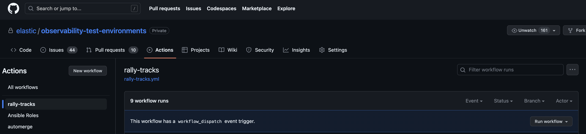
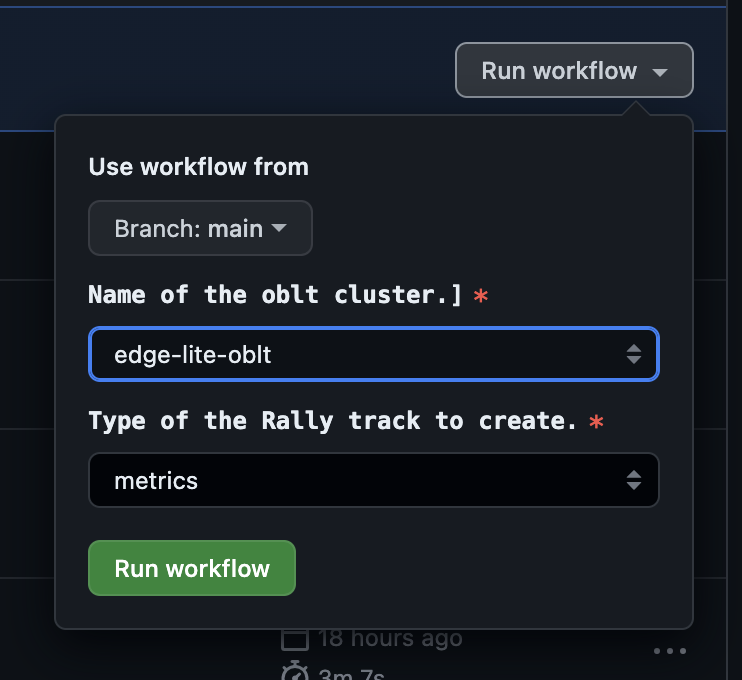
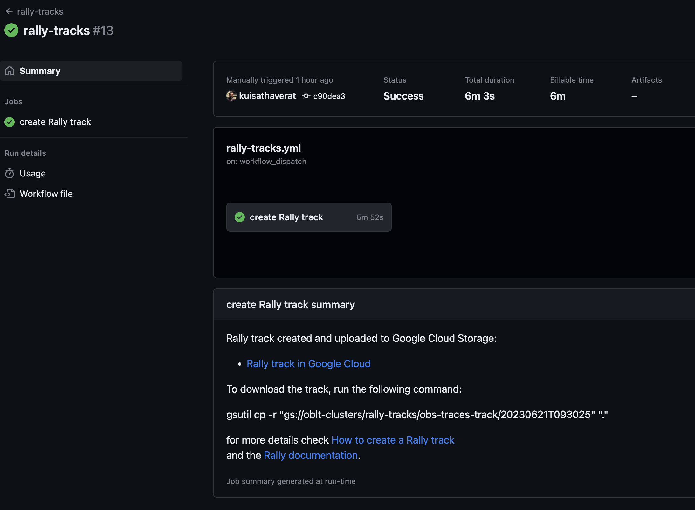
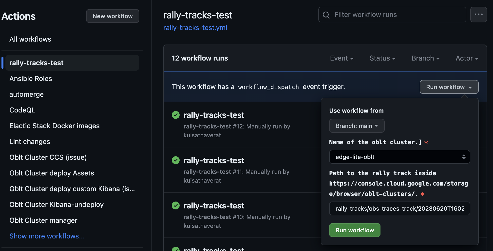
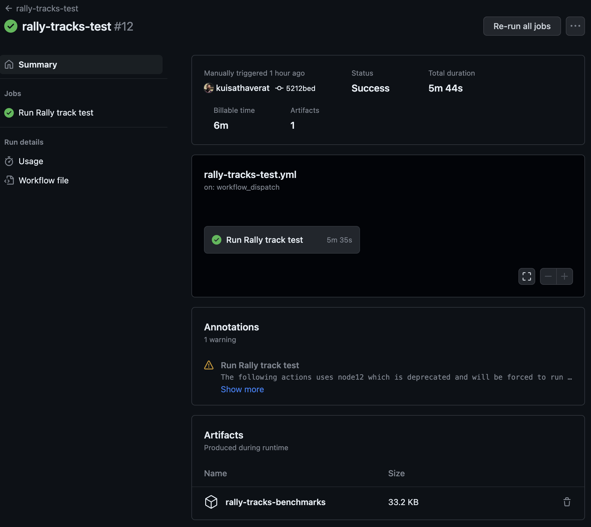
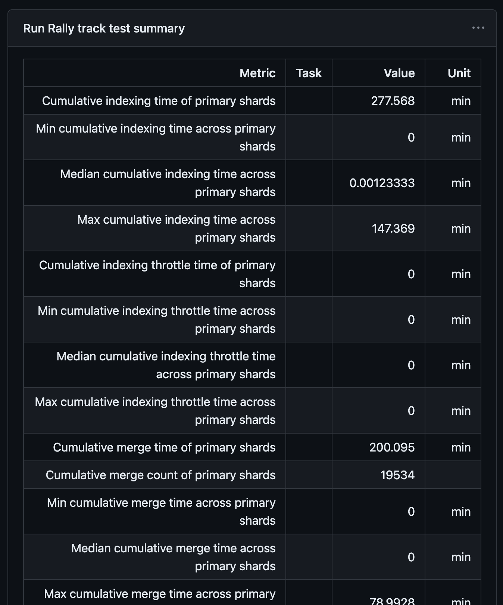
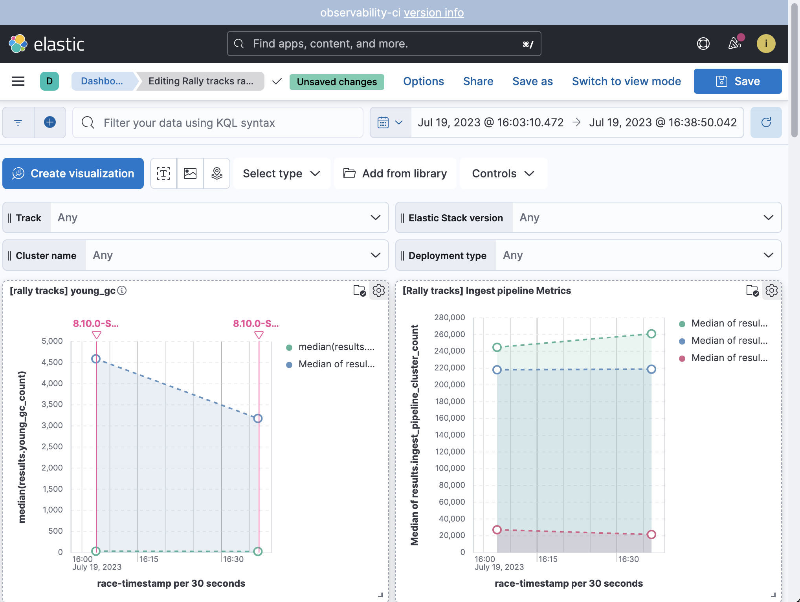

# Rally tracks

[Rally][rally] is a tool for benchmarking Elasticsearch.
Our oblt clusters are a good source of data to perform benchmarks on.
So joining both, we can use Rally to benchmark our clusters with a big amount of data.

!!! warning "Sensible data"

    Rally tracks can contain sensitive data, so they are not public.

We have three clusters created only for benchmarking:

* [edge-benchmarks](https://github.com/elastic/observability-test-environments/tree/main/environments/users/robots/benchmarks/edge-benchmarks)
* [release-benchmarks](https://github.com/elastic/observability-test-environments/tree/main/environments/users/robots/benchmarks/release-benchmarks)
* [serverless-benchmarks](https://github.com/elastic/observability-test-environments/tree/main/environments/users/robots/benchmarks/serverless-benchmarks)

These three clusters are recreated every day at 20:00 UTC by the workflow [Oblt Cluster update scheduled](https://github.com/elastic/observability-test-environments/actions/workflows/cluster-update-schedule.yml)

Every day at 23:00 UTC, the workflow [rally-tracks-test-daily](https://github.com/elastic/observability-test-environments/actions/workflows/rally-tracks.test-daily.yml) is launched to execute the three rally track races on the three benchmarks clusters and report the results.

## How to create a rally track

### Using the CI

The CI can do it for you, and it is the recommended way to create a rally track.
The process to create a rally track can take a long time, so it is not recommended to do it manually.
To create a rally track using the CI you have to run the [rally-track][rally-track-wf] workflow.

{: style="width:650px"}

This workflow has a button `run workflow` that you have to click to run the workflow.
After clicking the button, you will see the parameters of the workflow.

* branch: The branch of the observability-test-environments repository to use, it is only for develop the workflow and make changes on it.
* Name of the oblt cluster: The oblt cluster to use as source of the data.
* Type of rally track: The type of rally track to create, it can be `traces`, `metrics` or `logs`.

{: style="width:450px"}

Finally when the CI create the rally track and upload the data to the [Bucket][rally-tracks-bucket]
you will see a link to the rally track in the summary of the workflow.

{: style="width:550px"}

!!! warning "Rally size"

    The oblt clusters have a large amount of data the creation of a rally track could take hours.
    It would depend on the track selected and the amount of data on the cluster for that track.

!!! warning "Rally tracks for metrics"

    The rally tracks for metrics are not generated properly yet.
    They need some manual changes to make it work.

### Manually

To create a rally track, you can use the observability test environments repository.
In this repository we have the same Ansible playbook is run in the CI to create the rally track.
To create a rally track you have to select the oblt cluster you want as source of the data,
and run the following command:

To create a rally track for traces

```bash
CLUSTER_NAME=edge-lite-oblt
make -C "environments/users/robots/${CLUSTER_NAME}" tasks-rally-track-traces
```

To create a rally track for metrics

```bash
CLUSTER_NAME=edge-lite-oblt
make -C "environments/users/robots/${CLUSTER_NAME}" tasks-rally-track-metrics
```

To create a rally track for logs

```bash
CLUSTER_NAME=edge-lite-oblt
make -C "environments/users/robots/${CLUSTER_NAME}" tasks-rally-track-logs
```

!!! warning "Rally tracks for metrics"

    The rally tracks for metrics are not generated properly yet.
    They need some manual changes to make it work.

### Fix a metrics rally track

The rally tracks for metrics are not generated properly yet.
They need some manual changes to make it work.
After creating a rally track for metrics you will need to execute a Python script to fix the files, fix the `track.json` file, and add the ingest pipeline to the `track.json`.

To fix the files you have to run the following command:

```bash
TRACK_FOLDER=~/20230801T164123/obs-metrics
ES_URL=https://edge-lite-oblt.es.us-west2.gcp.elastic-cloud.com:443
ES_USERNAME=elastic
ES_PASSWORD=ThIsIsNoTaReAlPaSsWoRd
TRACK_NAME=obs-metrics

python3 -m venv .venv
source .venv/bin/activate
pip install -r ./ansible/requirements.txt

.ci/scripts/rally-tracks/rally-track-builder.py \
  --track-path "${TRACK_FOLDER}" \
  --track-name "${TRACK_NAME}" \
  --es-url "${ES_URL}" \
  --es-password "${ES_PASSWORD}" \
  --es-username "${ES_USERNAME}"
```

!!! warning "Processing time"

    The process have to sort and recompress all the files, so it could take a long time.

!!! warning "Requirements"

    The script requires Python 3.9 or higher.
    It is recommend to have [7zip](https://www.7-zip.org/) or [pbzip2](http://compression.great-site.net/pbzip2/) installed on your system.
    You will need [jlsort](https://github.com/winebarrel/jlsort) installed on your system.

### Upload the rally track to the bucket

When we create a rally track locally the rally track is not uploaded to the GCS bucket.
To upload the rally track to the bucket you have to run the following command:

```bash
LOCAL_FOLDER=./ansible/build/rally-tracks/obs-logs-track/20230718T102712
REMOTE_FOLDER=oblt-clusters/rally-tracks/obs-logs-track/20230718T102712
gsutil cp -r "${LOCAL_FOLDER}" "gs://${REMOTE_FOLDER}"
```

## Access to the rally tracks

The rally tracks are uploaded to the oblt-clusters GCS bucket to a folder called `rally-tracks`.
There are three types of rally tracks, thus we have three folders inside the `rally-tracks` folder.

* `obs-traces-track` for APM traces rally tracks
* `obs-metrics-track` for metrics rally tracks
* `obs-logs-track` for logs rally tracks

Every rally track has it own folder inside the `rally-tracks` folder.
The folder of each track is the ISO 8601 date when the track was created.
It is possible to access to the rally tracks using the google cloud console or using the gsutil command.

[Rally tracks on Google cloud console][rally-tracks-bucket]

To download a rally track using gsutil:

```bash
REMOTE_FOLDER=oblt-clusters/rally-tracks/obs-traces-track/20230620T124004
gsutil cp -r "gs://${REMOTE_FOLDER}" ~/.rally/tracks
```

## How to execute a rally track race

The aim of the rally tracks we generate is to benchmark the oblt clusters.
There are two ways to execute a rally tracks race, using the CI or manually.
The recommendation is to use the CI, because it is easier and faster.
Also the CI will upload the results to the GCS bucket and observability-ci cluster, so you can access to them easily.

### Run a race using the CI

We have created a workflow to execute the rally tracks in the oblt clusters.
This workflow is called [rally-tracks-test][rally-tracks-test-wf].

{: style="width:650px"}

This workflow has a button `run workflow` that you have to click to run the workflow.
After clicking the button, you will see the parameters of the workflow.
You have to choose the oblt cluster to benchmark and the rally track to use.
The rally track is a link to the rally track in the GCS bucket.
for example for the link `gs://oblt-clusters/rally-tracks/obs-traces-track/20230620T160218/obs-traces`
the path to the rally track inside the bucket is `rally-tracks/obs-traces-track/20230620T160218/obs-traces`.

When the workflow finishes, you will have the benchmark results in the summary of the workflow.
there you can download the results using the `rally-tracks-benchmarks` artifact link.

{: style="width:650px"}

If you only need to take a look to the results the workflow summary show the esrally report.

{: style="width:650px"}

### Run a race Manually

To execute a rally tracks race manually, you can use the observability test environments repository.
You have to choose the cluster you want to benchmark and the rally track to use.
You must [download the rally track](#access-to-the-rally-tracks) to some place in your computer before running the benchmark.
Then you have to run the following command:

```bash
CLUSTER_NAME=edge-lite-oblt
export TRACK_PATH=~/.rally/tracks/obs-traces-track/20230620T124004
make -C "environments/users/robots/${CLUSTER_NAME}" tasks-rally-test
```

The rally track race result will be stored in the `./ansible/build/.rally/benchmarks` folder.
If you want to upload those result to the GCS bucket you can run the following command:

```bash
LOCAL_FOLDER=~/.rally/benchmarks/20230620T124004
REMOTE_FOLDER=oblt-clusters/rally-tracks/benchmarks/20230620T124004
gsutil cp -r "${LOCAL_FOLDER}" "gs://${REMOTE_FOLDER}"
```

## Access to benchmark results

The benchmark results are uploaded to the oblt-clusters GCS bucket to a folder called `rally-tracks/benchmarks`.
Every execution of the Rally tracks test workflow create a new folder inside the `benchmarks` folder.

To download the benchmark results using gsutil:

```bash
REMOTE_FOLDER=oblt-clusters/rally-tracks/benchmarks
gsutil cp -r "gs://${REMOTE_FOLDER}" ~/.rally
```

Then you can follow the instructions at [Compare Results: Tournaments][tournaments] to compare the results.

## Check the benchmark results in Kibana

The results of the rally tracks are uploaded to the observability-ci cluster.
This cluster has a [Rally tracks dashboard][race-dashboard] to check the results.
The dashboard allow you to select a range of time, the type of rally track (logs, metrics, apm),
the Elastic Stack version, the type of deployment (ess, eck, serverless)
and the cluster (edge-oblt, edge-lite-oblt, ...) to see the results.

{: style="width:650px"}

[rally]: https://esrally.readthedocs.io/en/stable/index.html
[rally-tracks-bucket]: https://console.cloud.google.com/storage/browser/oblt-clusters/rally-tracks;
[rally-track-wf]: https://github.com/elastic/observability-test-environments/actions/workflows/rally-tracks.yml
[rally-tracks-test-wf]: https://github.com/elastic/observability-test-environments/actions/workflows/rally-tracks-test.yml
[tournaments]: https://esrally.readthedocs.io/en/stable/tournament.html
[race-dashboard]: https://observability-ci.kb.us-west2.gcp.elastic-cloud.com/app/dashboards#/view/474cd990-3208-11ee-b434-91e1bca21f24
