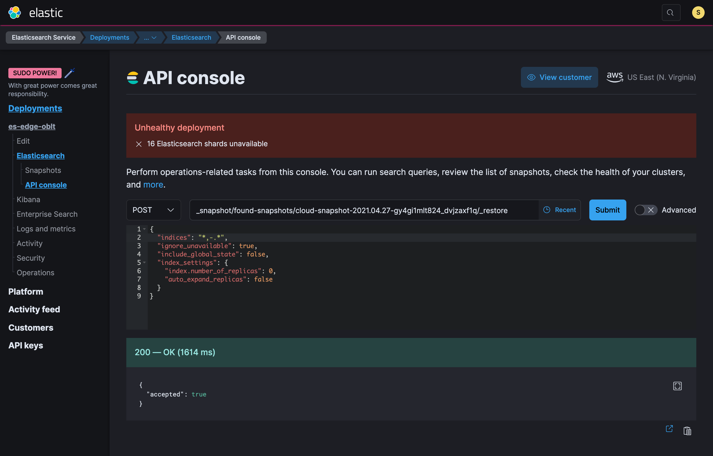

# Restore a snapshot

## Using the Kibana UI

There are some cases where we have to restore data from one of the snapshot of the cluster.
To do that we use the Kibana UI, in those cases where it is not possible to use the Kibana UI,
we use the Elasticsearch API.

[Kibana - Tutorial: Snapshot and Restore](https://www.elastic.co/guide/en/kibana/current/snapshot-restore-tutorial.html)

## Using scripts

### Get the list of snapshots

There is an script to simplify the work to check the snapshot to restore,
This script returns the snapshot in the repository.
We have to pick one that we know is fine,
it would depend on how much time the cluster has been broken.

```bash
.ci/scripts/ec_snapshot_list.sh CLUSTER_NAME
```

```json
{
  "state": "SUCCESS",
  "name": "cloud-snapshot-2021.04.27-meqeqxzfqnuy32vbfhgoyg",
  "start_time": "2021-04-27T14:59:59.881Z",
  "end_time": "2021-04-27T15:00:58.878Z",
  "failures": [],
  "shards": {
    "total": 118,
    "failed": 0,
    "successful": 118
  }
}
{
  "state": "SUCCESS",
  "name": "cloud-snapshot-2021.04.27-9gvgyyjfqngia5vt7kmuqw",
  "start_time": "2021-04-27T15:29:59.908Z",
  "end_time": "2021-04-27T15:32:10.729Z",
  "failures": [],
  "shards": {
    "total": 118,
    "failed": 0,
    "successful": 118
  }
}
```

### Prepare the environment

see [Manual Operations](../user-guide/use-case-connect-to-k8s-cluster.md)

### Set the cluster in maintenance mode

To avoid to ingest data, index creation and other operations that
can conflict with the snapshot restore, we should put the cluster in maintenance mode.
This will disable the routes to Elasticsearch, we can still use the API from ESS UI.

```bash
.ci/scripts/ec_maintenance_mode_start.sh edge-oblt
```

### Restore the snapshot

We have to connect to the ESS UI go to the Elasticsearch deployment,
there we access to the API console to launch the following request,
this will restore the `cloud-snapshot-2021.04.27-gy4gi1mlt824_dvjzaxf1q`.
From this snapshot we have requested the `.kibana*` indices,
and any other indices that do not start with a `.`.

{: style="width:600px"}

```json
POST _snapshot/found-snapshots/cloud-snapshot-2021.04.27-gy4gi1mlt824_dvjzaxf1q/_restore
{
  "indices": ".kibana*",
  "ignore_unavailable": true,
  "include_global_state": false,
  "index_settings": {
    "index.number_of_replicas": 0,
    "auto_expand_replicas": false
  }
}
```

```json
POST _snapshot/found-snapshots/cloud-snapshot-2021.04.27-gy4gi1mlt824_dvjzaxf1q/_restore
{
  "indices": "*,-.*",
  "ignore_unavailable": true,
  "include_global_state": false,
  "index_settings": {
    "index.number_of_replicas": 0,
    "auto_expand_replicas": false
  }
}
```

In some cases you have a partial restore data from the restore operation,
in those cases the recommendation is deleting those indices before to restore the snapshot to avoid issues.

## Wait for the data restored

We have to wait for the data restored to open the cluster to connections,
to check the status we can check the health REST call
and wait until there is no `unassigned_shards`

```bash
GET _cluster/health
```

```json
{
  "cluster_name": "b5caf8c576704714a9bb2559bddab987",
  "status": "yellow",
  "timed_out": false,
  "number_of_nodes": 13,
  "number_of_data_nodes": 6,
  "active_primary_shards": 179,
  "active_shards": 187,
  "relocating_shards": 0,
  "initializing_shards": 6,
  "unassigned_shards": 12,
  "delayed_unassigned_shards": 0,
  "number_of_pending_tasks": 0,
  "number_of_in_flight_fetch": 0,
  "task_max_waiting_in_queue_millis": 0,
  "active_shards_percent_as_number": 91.21951219512195
}
```

## Start routing request to the cluster

When the data is restored we have to open the cluster for connection,
the following script will enable routing again.

```bash
.ci/scripts/ec_maintenance_mode_stop.sh edge-oblt
```
