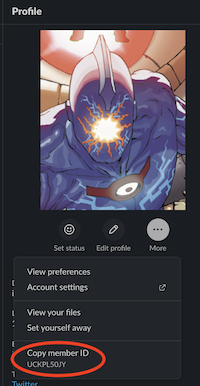

# Oblt-cli

The `oblt-cli` tool is a multi-purpose tools that:

* allows anyone with access to the observability test environments repository and Git configured to create/update/destroy oblt clusters configured for CCS.
* queries the Unified Release process to gather what are the current releases, snapshots or active branches.

## Installation

The oblt-cli binaries are published as packages at the [observability test environment releases](https://github.com/elastic/observability-test-environments/releases).

### macOS via Homebrew

`Homebrew` is the easiest way to install `oblt-cli` on `macOS`. See the [Homebrew documentation](https://brew.sh/) for installation and usage explanations.

> **NOTE:**
> Since `v6.3.1`

First configure the `oblt-cli` third-party repository (called a "tap") with:

```bash
export HOMEBREW_GITHUB_API_TOKEN=$(gh auth token)
brew tap elastic/oblt-cli
```

or if you have git setup to default over SSH:

```bash
env HOMEBREW_GITHUB_API_TOKEN=(gh auth token) brew tap elastic/oblt-cli git@github.com:elastic/homebrew-oblt-cli
```

Then proceed with the actual installation with: `brew install elastic/oblt-cli/oblt-cli`


### Manual process

You have to uncompress the package and copy the `oblt-cli` binary in a folder inside your `PATH`.

> **NOTE:**
> `macOS` users will have to manually verify the binary using this command:

```shell
xattr -r -d com.apple.quarantine oblt-cli
```

### Go way

If you have Go installed in your machine you can install the tool using the following command:

```bash
GOPRIVATE=github.com/elastic go install github.com/elastic/observability-test-environments/tools/oblt-cli@latest
```

## Configure

In order to use the oblt-cli tool it is needed to configure a couple of values used by all the commands, the following command will create a configuration folder `~/.oblt-cli` and a config file `~/.oblt-cli/config.yaml` with the settings passed as parameters.

!!! Warning

    The Slack member ID require to add a `@` before the Slack member ID, for example `@MYSLACKMEMBERID`.

```shell
oblt-cli configure --slack-channel=@MYSLACKMEMBERID --username=my_github_username
```

or

```shell
oblt-cli configure --interactive
```

**NOTE** The Slack member ID is required, the Slack display name does not work in some cases. To grab your Slack member ID you have to go to your profile an copy it.



By default oblt-cli uses SSH to perform Git operations, it is the recommended way,
however, HTTP is supported. To configure oblt-cli to use HTTP use the flag `--git-http-mode`
in the configure command:

```shell
oblt-cli configure --slack-channel=@MYSLACKMEMBERID --username=myusername --git-http-mode
```

To perform git operations using HTTP a valid [GitHub access token](https://docs.github.com/en/authentication/keeping-your-account-and-data-secure/creating-a-personal-access-token) and [Caching your GitHub credentials in Git](https://docs.github.com/en/github-ae@latest/get-started/getting-started-with-git/caching-your-github-credentials-in-git) is needed or alternatively: [Updating credentials from the macOS Keychain](https://docs.github.com/en/github-ae@latest/get-started/getting-started-with-git/updating-credentials-from-the-macos-keychain)

## Troubleshooting

### Github credentials problem

Github does not support authentication via `username:password` anymore. So if you are asked to enter your github username when running any `oblt-cli` command, you first need to follow the steps to create a new [GitHub access token](https://docs.github.com/en/authentication/keeping-your-account-and-data-secure/creating-a-personal-access-token) (select all **repo** options).

Then allow the newly generated token to access the Elastic organisation, by clicking the `Enable SSO` button, and then selecting `Authorize` and follow through the steps.

With the new GH access token in hands run:

```shell
$ oblt-cli version
...
$ Username for 'https://github.com': <GH_USER_NAME>
$ Password for 'https://<GH_USER_NAME>@github.com': <GH_ACCESS_TOKEN>
...
$ oblt-cli version X.Y.Z
```

Once you've done that, you should never have to enter you GitHub credentials when running any `oblt-cli` command again, unless they have expired.

### Clean configuration

If you want to clean the configuration, you can remove the `~/.oblt-cli` folder.
It will remove the configuration file and the logs.
So in order to keep the configuration file, and clean the `~/.oblt-cli` folder,
you can use the following command:

```shell
oblt-cli clean
```

## Commands

It follows the format `entity` -> `verb`/ `entity` -> `sub-entity` (-> `verb`)?

| Command | What |
| ------- | ---- |
| `bootstrap`  | Command to bootstrap Elasticsearch or Kibana using known recipes. |
| `ci`         | Command to operate with the CI. |
| `cluster`    | Command to operate a cluster. |
| `completion` | generate the autocompletion script for the specified shell |
| `configure`  | It configures the oblt-cli. |
| `help`       | Help about any command |
| `unified-release`  | Command to query the Unified Release. |
| `update`     | Command to self-update the tool. |
| `version`    | Command to show tool's version. |

There are some flags that can help to add verbose output or dry run:

```shell
Flags:
      --config string        config file (default is ${HOME}/.oblt-cli/config.yaml)
      --dry-run              If true, the Git changes will not commit the changes made to the Git repository.
      --experimental         If true, the experimental features will be available.
  -h, --help                 help for oblt-cli
      --output-file string   It is the absolute path to a file to save the operation output results.
      --verbose              If true, the logs output is more verbose.
```

You can easily see what each command does by running `oblt-cli [command] --help`.

For more info about all command available check [oblt-cli command reference](./generated/oblt-cli.md)

### List clusters

It is possible to list the clusters deployed by the user by running

```shell
oblt-cli cluster list
```

This list the configurations available for a user.
The fact that the configuration exists does not mean the cluster is up an running.

There are more clusters configuration than the current user configuration,
the following command lists all available clusters.

```shell
oblt-cli cluster list --all
```

### Create CCS cluster

Once we have configured our general settings we can create a new cluster configured for CCS and received the credentials in slack, to do that we can use the following command.

```shell
oblt-cli cluster create ccs --remote-cluster=edge-oblt
```

This command will push a commit to the observability test environments repository, that commits triggers a build that takes about 5 min (https://apm-ci.elastic.co/job/apm-shared/job/oblt-test-env/job/manage-user-oblt-clusters/) when the build ends it will send a slack message with the result and the credentials (if it succeeded).

**NOTE**: The cluster-name parameter is the oblt cluster configured as a remote cluster for CCS, _not_ a unique name for the cluster. The `edge-oblt` name, for example, will deploy [this oblt cluster](https://github.com/elastic/observability-test-environments/blob/main/environments/edge-oblt/config-cluster.yml).

### Read secrets

When a cluster is created, certain secrets are created in Vault including useful information for the end users. In the past, those secrets were posted as Slack messages, which made it difficult to retrieve them again after a period of time without searching/scrolling up in the Slack channel.

Besides those Slack messages, it's possible to retrieve those Vault secrets from a cluster using this tool.
The tool provides three handy subcommands which allow to read three specific secrets from a cluster. These subcommands need the mandatory `--cluster-name` flag to select the cluster where to read the secret from.

**Read kibana's config file from a cluster:**

```shell
oblt-cli cluster secrets kibana-config --cluster-name=my-cluster
```

**Read users for a cluster:**

```shell
oblt-cli cluster secrets users --cluster-name=my-cluster
```

**Read deployment information from a cluster:**

```shell
oblt-cli cluster secrets info --cluster-name=my-cluster
```

**Get deployment all details in YAML**

```shell
oblt-cli cluster secrets digest --cluster-name=my-cluster
```

#### Reading all secrets

The tool provides an advanced mode which allows to list the Vault secrets from a cluster, prompting the user to select them from a list. Once selected, the secret will be posted as text in the terminal. This advanced mode is implemented under the `cluster secrets` command, which needs the mandatory `--cluster-name` flag to select the cluster where to read its secrets from.

```shell
oblt-cli cluster secrets --cluster-name=my-cluster
```

### Destroy a cluster

It is possible to destroy a cluster using the name to identified it.

```shell
oblt-cli cluster destroy --cluster-name=my-cluster
```

**NOTE** this removes the configuration from the repository, the the CI job destroy the cluster.

## Documentation

If you are interested in contributing to this project, please see [our contributing guide](CONTRIBUTING.md).

<sup><br>Made with ♥️ and ☕️ by 🤖.</sup>
