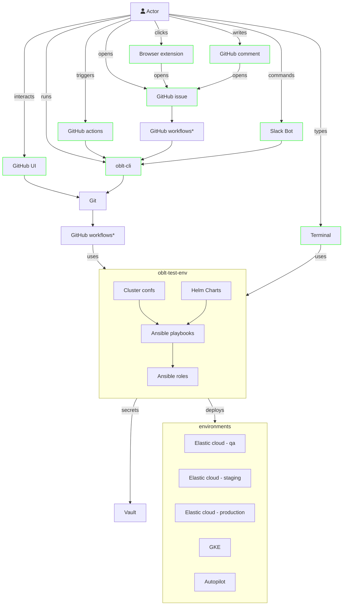
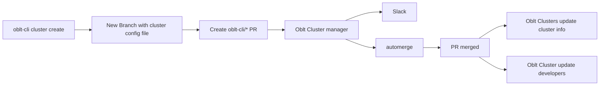
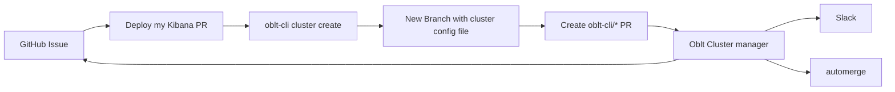
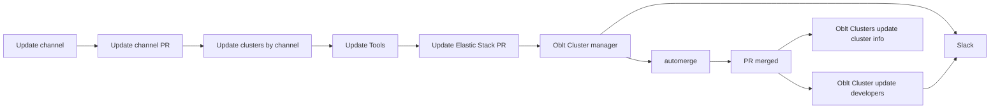

# Overview

## Interactions

The oblt clusters are managed by different interactions, such as [oblt-cli](/tools/oblt-cli/), [oblt-robot](/tools/oblt-robot/), [GitHub issues](https://github.com/elastic/observability-test-environments/issues/new/choose) and so on. Those interactions can happen
either by users or some systems.

The below diagram reflects how it's used



## Continuous Integration (CI)

The oblt clusters are drive by a set of CI workflows that run in GitHub Action.
The workflows are in the folder `.github/workflows` in the root of the repository.
Every workflow related to oblt clusters is prefixed with `cluster-`.
The workflows are triggered by the creation of a pull request with changes in the folder `environments/users`.
There are two types of changes, changes in [golden clusters](#golden-clusters) an changes in [developer clusters](#developer-clusters).

The process to create a cluster is the following:

- A developer uses `oblt-cli cluster create` to create a cluster configuration file from a [template](#templates).

  * oblt-cli uses the parameters and the template selected to create a new cluster configuration file.
  * oblt-cli pushes the changes to a feature branch in the repository.

- A pull request is created with the changes by [Oblt Clusters create oblt-cli/* PR](#create-oblt-cli-pr).
- The workflow [Oblt Cluster manager](#manager) process the changes and notify the result by Slack.
- If successful, the PR is merged by [automerge](#automerge).
- If failed, the PR is closed and Slack message with info about how to resolve the issue is sent to the user.

The process is always the same for golden and developer clusters.

When a change is made on a golden cluster and it is merged, a set of new workflows are triggered to update the developer clusters and update the cluster information pages.

* A PR with changes in a golden cluster is merged.
* The workflow [Oblt Clusters update cluster info](#update-cluster-info) is triggered.
* The workflow [Oblt Cluster update developers](#developer-clusters) is triggered.

## Oblt GitHub Actions

The oblt GitHub Actions are the GitHub Actions that manage the oblt clusters.
The actions are in the folder `.github/actions` in the root of the repository.
The oblt GitHub Actions use the [oblt-framework][] to manage the clusters.

### cluster-target

The GitHub Action `cluster-target` is used to run the [oblt-framework][] in the GitHub Actions.
The action uses [oblt-framework-docker][] container to run the [oblt-framework][].
The action prepare the GitHub runner to authenticate with the GCP, send notifications and grab the results.
This action exetute one of the targets available in the [oblt-framework-docker][].
This action is used by all the other actions to make especific tasks.
The GitHub Action `cluster-target` contains the version used of the [oblt-framework-docker][],
to bump the version of the [oblt-framework-docker][] the action must be updated.


```yaml
    - name: Run a target
      uses: ./.github/actions/cluster-target
      id: run-task
      with:
        target: 'help'
        clusterConfigFile: ${{ env.CLUSTER_CONFIG_FILE }}
        workloadIdentityProvider: ${{ secrets.WORKLOAD_IDENTITY_PROVIDER_ID }}
        serviceAccount: ${{ secrets.SERVICE_ACCOUNT_EMAIL }}
        dockerUsername: ${{ secrets.DOCKER_USERNAME }}
        dockerPassword: ${{ secrets.DOCKER_PASSWORD }}
        dockerRegistry: ${{ secrets.DOCKER_REGISTRY }}
        clusterConfigFile: ${{ github.workspace }}/environments/users/dummy/cluster-config.yml
        buildDir: ${{ github.workspace }}/build
```


[Action details](https://github.com/elastic/observability-test-environments/blob/main/.github/actions/cluster-target/action.yml)

### cluster-create

The GitHub Action `cluster-create` is used to create a cluster.
It sends the credentials of the clusters to Slack and GitHub issues if it is necessary.


```yaml
    - name: Create a cluster
      uses: ./.github/actions/cluster-create
      id: run-task
      with:
        clusterConfigFile: ${{ env.CLUSTER_CONFIG_FILE }}
        workloadIdentityProvider: ${{ secrets.WORKLOAD_IDENTITY_PROVIDER_ID }}
        serviceAccount: ${{ secrets.SERVICE_ACCOUNT_EMAIL }}
        dockerUsername: ${{ secrets.DOCKER_USERNAME }}
        dockerPassword: ${{ secrets.DOCKER_PASSWORD }}
        dockerRegistry: ${{ secrets.DOCKER_REGISTRY }}
        clusterConfigFile: ${{ github.workspace }}/environments/users/dummy/cluster-config.yml
        buildDir: ${{ github.workspace }}/build
```


[Action details](https://github.com/elastic/observability-test-environments/blob/main/.github/actions/cluster-create/action.yml)

### cluster-destroy

The GitHub Action `cluster-destroy` is used to destroy a cluster.


```yaml
    - name: Destroy a cluster
      uses: ./.github/actions/cluster-destroy
      id: run-task
      with:
        clusterConfigFile: ${{ env.CLUSTER_CONFIG_FILE }}
        workloadIdentityProvider: ${{ secrets.WORKLOAD_IDENTITY_PROVIDER_ID }}
        serviceAccount: ${{ secrets.SERVICE_ACCOUNT_EMAIL }}
        dockerUsername: ${{ secrets.DOCKER_USERNAME }}
        dockerPassword: ${{ secrets.DOCKER_PASSWORD }}
        dockerRegistry: ${{ secrets.DOCKER_REGISTRY }}
        clusterConfigFile: ${{ github.workspace }}/environments/users/dummy/cluster-config.yml
        buildDir: ${{ github.workspace }}/build
```


[Action details](https://github.com/elastic/observability-test-environments/blob/main/.github/actions/cluster-destroy/action.yml)

### cluster-update

The GitHub Action `cluster-update` is used to update a cluster.
It sends the credentials of the clusters to Slack and GitHub issues if it is necessary.


```yaml
    - name: Update a cluster
      uses: ./.github/actions/cluster-update
      id: run-task
      with:
        clusterConfigFile: ${{ env.CLUSTER_CONFIG_FILE }}
        workloadIdentityProvider: ${{ secrets.WORKLOAD_IDENTITY_PROVIDER_ID }}
        serviceAccount: ${{ secrets.SERVICE_ACCOUNT_EMAIL }}
        dockerUsername: ${{ secrets.DOCKER_USERNAME }}
        dockerPassword: ${{ secrets.DOCKER_PASSWORD }}
        dockerRegistry: ${{ secrets.DOCKER_REGISTRY }}
        clusterConfigFile: ${{ github.workspace }}/environments/users/dummy/cluster-config.yml
        buildDir: ${{ github.workspace }}/build
```


[Action details](https://github.com/elastic/observability-test-environments/blob/main/.github/actions/cluster-update/action.yml)

### Oblt-cli workflow



### Deploy my Kibana PR workflow



### Update Elastic Stack workflow



## Golden Clusters

Golden clusters are those clusters that have the property `golden_cluster` set to `true` in their cluster configuration file.
These clusters are permanent clusters that are updated regularly by the [update-tools](#update-tools) workflow.
There are two types of update daily and weekly.
Daily updates are done every day at 00:00 UTC and weekly updates are done every Monday at 00:00 UTC.
There are four channel to select the version to update `unstable`, `development`, `release`, or a specific version form other cluster (edge-lite-oblt).
Unstable channel updates to the latest versions from the `main` branch of the repositories.
Development channel updates to the latest versions from the branch currently in development of the repositories (usually next release A.B.(C-1)).
Release channel updates to the latest release/BC (usually last release A.B.(C)).
The channel is set in the `stack.update_channel` property of the [cluster configuration file][].

There are two modes to make the update, a simple `update` or a `recreate`.
The value of the `stack.update_mode` property of the [cluster configuration file][] defines the mode (by default `stack.update_mode: update`).
A simple update updates the components to the Elastic Stack version and other changes made on the configuration file.
In simple `update` case there is no data lost.
A `recreate` update mode would destroy and recreates the cluster from scratch with the new configuration.
In `recreate` update mode the data is lost.

## Developer Clusters

Developer clusters are those created by the developers to test changes on their code.
There are several [templates](#templates) to create developer clusters.
The developer use [oblt-cli](/tools/oblt-cli/) to easily create a cluster from a template.
It is possible to create cluster configuration files manually and push the changes to the repository manually,
the effect is the same as using oblt-cli.

## Oblt Cluster Workflows

### Manager

The workflow Oblt Cluster manager is the main workflow that process the changes in the cluster configuration files.
The workflow is triggered by the creation of a pull request with changes in the folder `environments/users`.
The workflow will destroy, create, or update the cluster depending on the changes in the cluster configuration file.
A delete of a file will destroy the cluster.
A new file will create a cluster.
A change in the cluster configuration file will update the cluster.
The workflow will notify the result by Slack.
The summary of the workflow contains links to logs and the cluster, this links are useful to debug/troubleshooting the workflow.

In case of infrastructure issues, we can retry to execute the failed jobs.

### Update cluster info

When a golden cluster is updated this workflow is triggered to update the cluster information pages.

### Update developers

When a golder cluster is updated this workflow is triggered to update the developer clusters.
It search for developers clusters that are using the golden cluster and update them.
A PR is generated for each developer cluster and the developer is notified by Slack.

### Check licenses

Every Monday this workflow checks the licenses of the clusters.
It runs every Monday at 00:00 UTC.
It notifies by Slack the clusters with licenses issues and instructions to resolve the issue.

!!! Note

    SNAPSHOT deployments have a trial license that expires in 30 days.

### Deploy custom Kibana (issue)

This workflow manage the request to [Deploy my Kibana PR](/user-guide/deploy-my-kibana-pr/)
when the request is made by a GitHub issue.

### Ephemeral-undeploy

This workflow undeploy all Kibana PR clusters create during the week.
It also destroy ephemeral clusters created by CI test that left resources undestroyed.
It runs every Saturday at 05:00 UTC.

### Oblt Cluster CCS (issue)

Oblt Cluster CCS workflow create a CCS cluster based on the configuration on a `Create CCS cluster`.
It is similar to `oblt-cli cluster create ccs` but using a GitHub issue to trigger the creation.

### automerge

This workflow merge pull request that have the label `automerge` and the CI pass.
It only watch a few kinds of pull request.

### Elastic Stack Docker images

Download and push the Elastic Stack Docker images to `docker.elastic.co/observability-ci` namespace.
It runs every hour and check if there is a new version of the images.
We download only a subset of the images, the ones used by the oblt clusters.
We download the last two SNAPSHOTs and the last release/BC.
The Docker images are tagged with the version, the commit hash, and the date.

### Opbeans Android App Uploader

Build and push the opbeans-android binary to Sauce Labs.
This will generate data for the opbeans-android app on the `edge-lite-oblt` cluster.

### Opbeans Swift Data Generator

Build and push the opbeans-swift binary to Sauce Labs.
This will generate data for the opbeans-swift app on the `edge-lite-oblt` cluster.

### Update Tools

Update tools workflow runs daily tools updates.
It runs everyday at 00:00 UTC.

## Update Channels

Update tools workflow runs daily to update the `.ci/update-versions/update_channels.json` file.
This file contains the latest version of the Elastic Stack for each channel.
It runs everyday at 00:00 UTC.

## Update Helm Charts

This workflow runs daily to update the Helm charts.
It runs everyday at 00:00 UTC.

## Update cluster channels

It runs ob changes in the `.ci/update-versions/update_channels.json` file to update the Elastic Stack version of the clusters.
It uses the `stack.update_channel` property of the cluster configuration file to select the channel to update.
The frequency of the update is defined by the `stack.update_schedule` property of the cluster configuration file.

### Create oblt-cli/* PR

This workflows is triggered when a branch oblt-cli/* is created.
The workflow will create a pull request with the changes in the branch.
The PR is made in this way to simplify the process in oblt-cli.

## Templates

Each template is a `.tmpl` in the `environments/users` folder.
The templates are designed to cover a specific use case.
The template is used by oblt-cli to create a cluster configuration file and push changes to a feature branch.


[cluster configuration file]: /user-guide/cluster-config
[oblt-framework]: ./ansible-collection.md
[oblt-framework-docker]: ./docker.md
