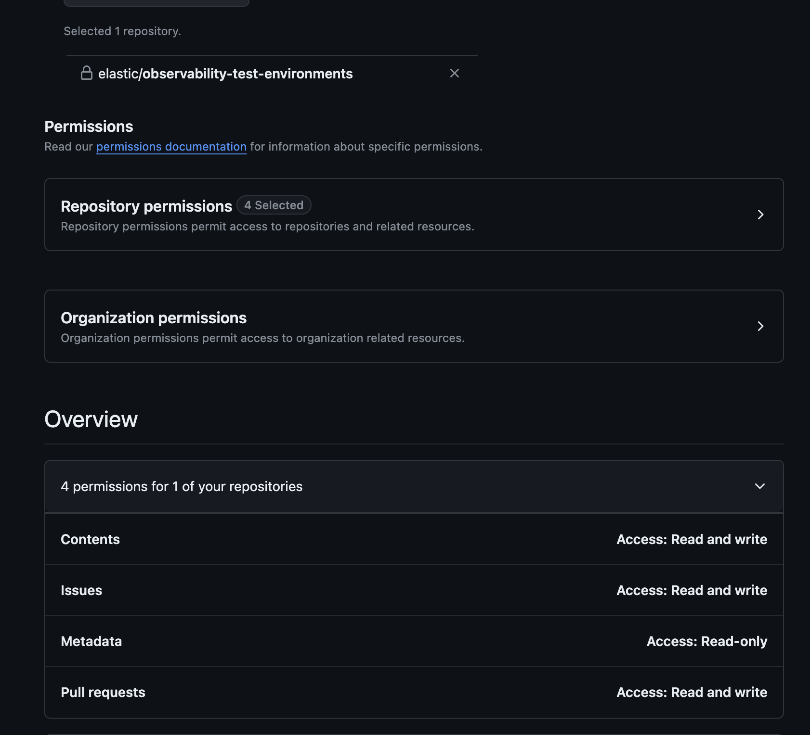

# Configuration

## Deploy

The oblt-robot is deployed in the elastic-app k8s cluster, it is deployed in the `apm` namespace.
Oblt-robot has 4 replicas and it is deployed using a deployment.
To deploy the `manifest.yml` you can use the following command:

```shell
# Get the cluster credentials
make -C tools/oblt-robot elastic-apps-env
# Deploy the oblt-robot
make -C tools/oblt-robot deploy
```

And for undeploying it:

```shell
# Get the cluster credentials
make -C tools/oblt-robot elastic-apps-env
# Deploy the oblt-robot
make -C tools/oblt-robot undeploy
```

## Secrets

`tools/oblt-robot/Makefile` is the one that contains a make goal called `create-env` to
configure the required environment variables with the secrets to be used.

It uses the below secrets:

* `vault read secret/k8s/elastic-apps/apm/oblt-robot`
* `gcloud secrets versions access latest --secret=oblt-clusters_observability-ci_cluster-state`

## Elasticsearch integration

It uses `oblt-clusters_observability-ci_cluster-state`, if you need to change the credentials, then please update the fields in `secret/k8s/elastic-apps/apm/oblt-robot-elasticsearch`:

* `ELASTICSEARCH_PASSWORD`
* `ELASTICSEARCH_URL`
* `ELASTICSEARCH_USERNAME`

## APM Instrumentation

It uses `oblt-clusters_observability-ci_cluster-state`, if you need to change the credentials, then please update the fields in `secret/k8s/elastic-apps/apm/oblt-robot-apm-server`:

* `ELASTIC_APM_SERVER_URL`
* `ELASTIC_APM_SERVICE_NAME`

## GitHub integration

It uses the `obltmachine` GitHub user to interact with the `observability-test-environments` repository.

### Fine-grained GitHub tokens

GitHub secret needs to be updated at least once every 6 months. This is now reported with some automation, see https://github.com/elastic/observability-robots/pull/2118.

#### Permissions

{:style="width:450px"}

#### How to rotate the secret

The [service machine user guide](https://github.com/elastic/observability-robots/blob/main/docs/machine-user.md#github-user-details) explains how to access.

Go to [oblt-test-env_oblt-robot](https://github.com/settings/personal-access-tokens/3106228) token once you have logged in with `obltmachine`.

Then, `Regenerate Token` and update the Vault secret `secret/k8s/elastic-apps/apm/oblt-robot` and follow the steps to deploy the Slack bot explained above.
