# oblt-robot

`oblt-robot` is the Slack application that the Robots team has created to automate tasks on Slack. With that major goal, product teams will interact with the bot on Slack to perform certain tasks without the supervision of the Robots team.

The Slack bot is basically intended to mimic many of the existing capabilities that the `oblt-cli` tool does, but using Slack as the user interface. Apart from that, the Robots team could extend those features to automate more tasks for the product teams.

If you are interested in contributing to the Slack bot, please read [the contributing guide](./CONTRIBUTING.md).

If you are interested in configuring the Slack bot, please read [the configuration guide](./CONFIGURATION.md).

There are a few ways to interact with a Slack bot: mentions, slash commands and interactions.

## Where I can find the oblt-robot?

The oblt-robot is deployed in some Slack channels.
You can find the oblt-robot in the following channels:

* `#observability-robots`
* `#observablt-bots`

To start a conversation with oblt-robot, you can mention it or use a slash command.
For example to ask for help you can mention the bot in one of the channels where it is deployed:

```shell
@oblt-robot help
```

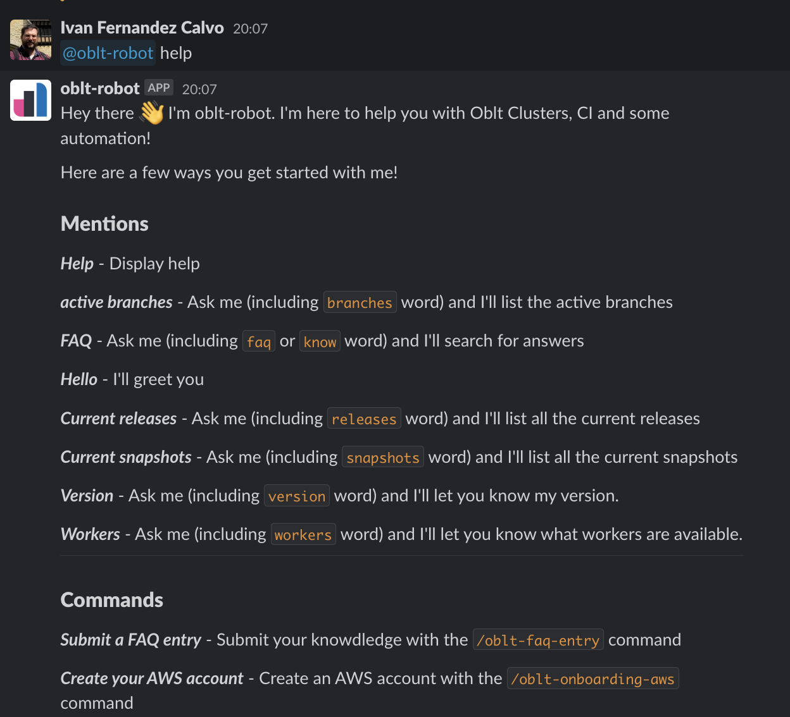{: style="width:450px"}

At this point you are ready to interact with the Slack bot.
The most common way to interact with the Slack bot is using slash commands.

## Slash commands

To use a slash command you need to type `/` and the name of the command.
For example to list the available commands you can type:

```shell
/my-clusters
```

You will received a message from the Slack bot with the list of your clusters

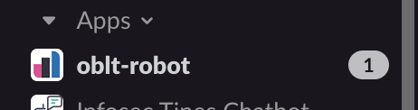{: style="width:450px"}

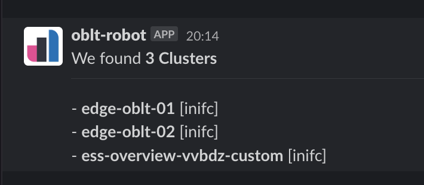{: style="width:450px"}

### /my-clusters

List current user's clusters.
It sends a message in the private channel of the User.
The bot will retrieve a list with the clusters that belong to the Slack user interacting with it.

```shell
/my-clusters
```

{: style="width:450px"}

### /list-templates

List all templates to create a cluster.
It sends a message in the private channel of the User.
The bot will retrieve a list with all templates in the observability test environments.

```shell
/list-templates
```

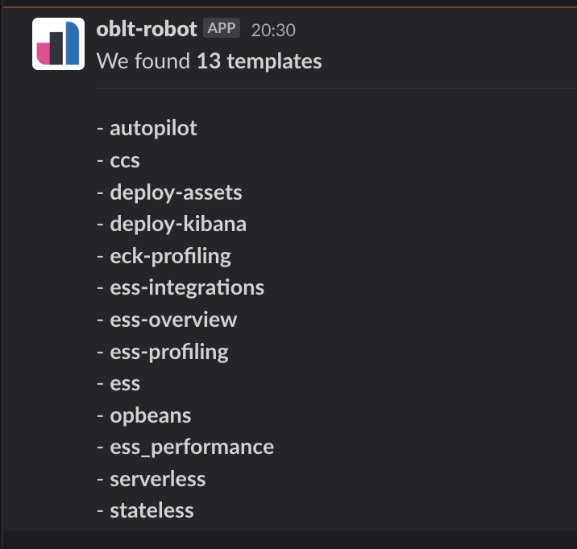{: style="width:450px"}

### /create-ccs-cluster

Create a CCS cluster.
A modal window on Slack to fill in a form.
A message in the private channel of the User about GitHub building the cluster.
The bot will prompt the user with the required and optional parameters to create a CCS cluster.

```shell
/create-ccs-cluster
```

{: style="width:450px"}

### /create-serverless-cluster

Create a Serverless cluster.
A **modal window** on Slack to select the serverless cluster to be created.
A message in the private channel of the User about GitHub building the cluster.
The bot will prompt the user with the required and optional parameters to create the serverless cluster.

```shell
/create-serverless-cluster
```

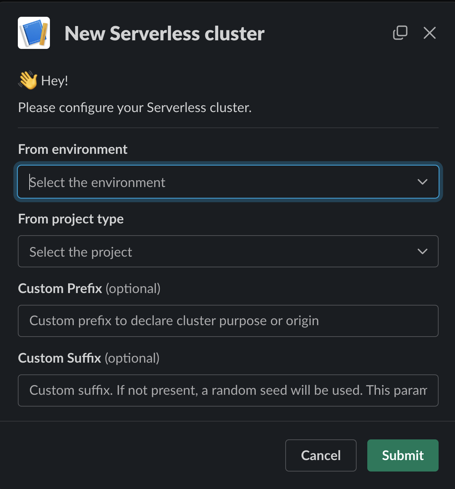{: style="width:450px"}


### /destroy-cluster

Destroy a cluster.
A **modal window** on Slack to select the cluster to be destroyed.
A message in the private channel of the User about GitHub destroying the cluster.
The bot will prompt the users for a cluster they own. Once selected and submitted the cluster, the bot will remove the files for the selected cluster.

```shell
/destroy-cluster
```

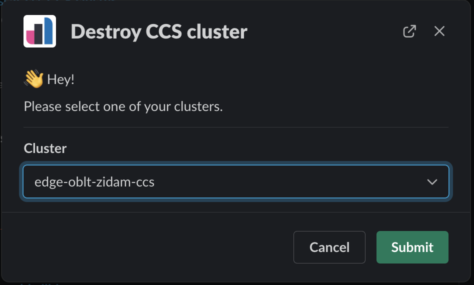{: style="width:450px"}

### /cluster-secret

List and read the secrets from a cluster.
A **modal window** on Slack to select the cluster, **buttons** to read a secret.
A message in the private channel of the User with the list of secrets, a thread message with the contents of the secret.
The bot will prompt the users for a cluster they own. Once selected and submitted the cluster, the bot will post a private message with the list of secrets from the cluster, including a `Read secret` button on each of them. The user will be able to click the button, opening a thread message with the content of the secret.

```shell
/cluster-secret
```

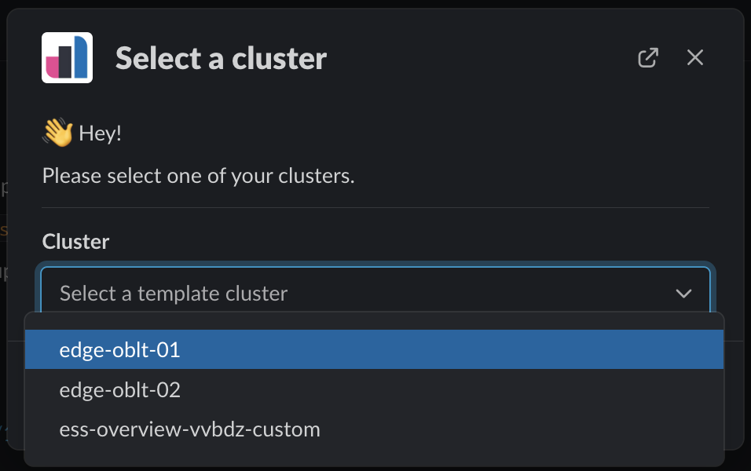{: style="width:450px"}

### /list-clusters

List all observability clusters.
A message in the private channel of the User.
The bot will retrieve a list with all clusters in the observability test environments.

```shell
/list-clusters
```

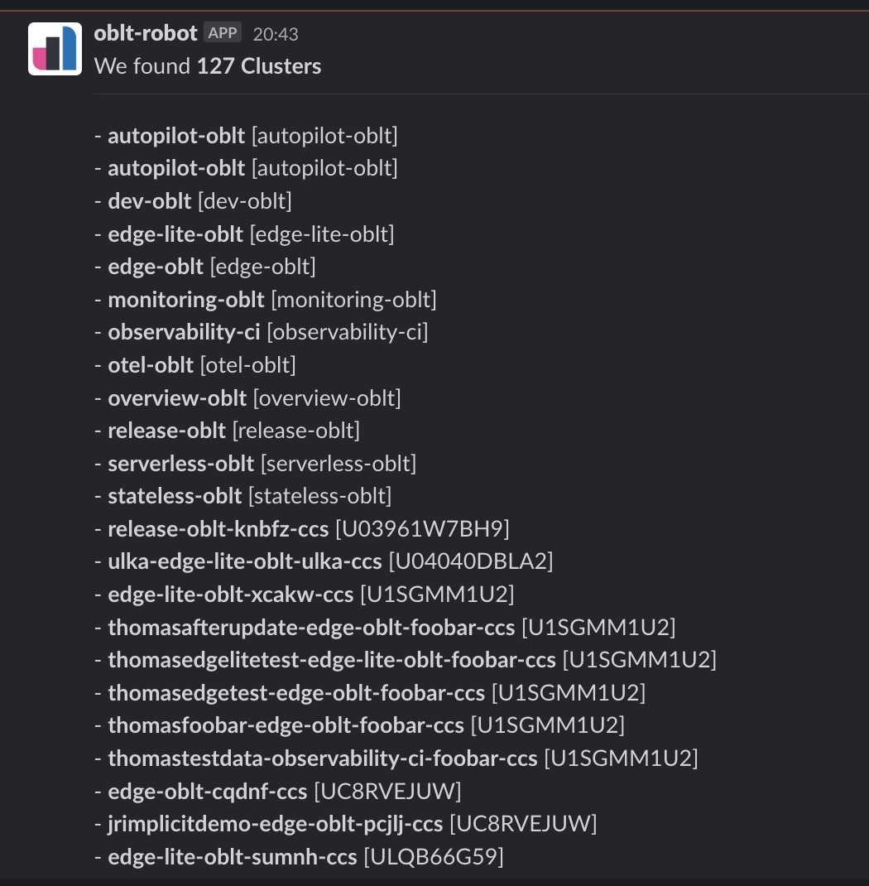{: style="width:450px"}

### /show-status (disabled)

Show the status from the System Status page.
A message in the private channel of the User.
The bot will retrieve the status messages from https://github.com/elastic/observability-system-status.

```shell
/show-status
```

### /oblt-bug-report (disabled)

Submit a Bug Report in the observability-robots project.
A **modal window** on Slack to fill in a form.
A message in the private channel of the User about the bug has been created.
The bot will prompt the user with the required parameters to submit the new Bug report.

```shell
/oblt-bug-report
```

### /oblt-faq-entry

Submit a FAQ entry in the FAQ database.
A **modal window** on Slack to fill in a form.
A message in the private channel of the User about the FAQ entry has been created.
The bot will prompt the user with the required parameters to submit the new Knowledgebase entry.

```shell
/oblt-faq-entry
```

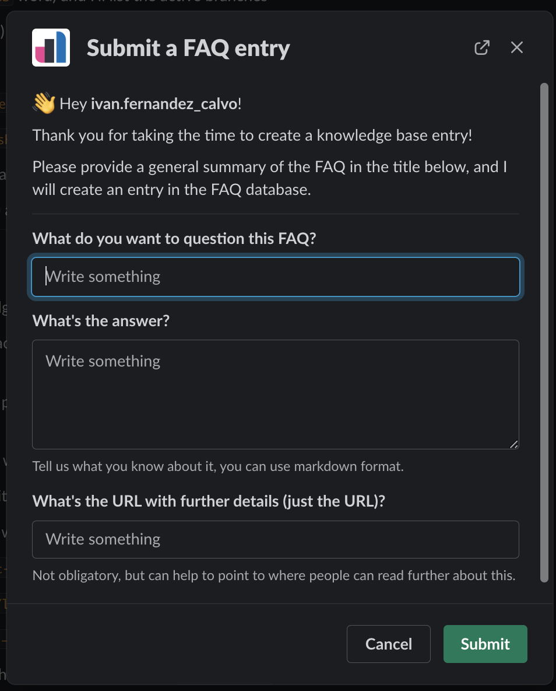{: style="width:450px"}

### /oblt-onboarding-aws

Create an AWS account for the `elastic-observability` project.
A **modal window** on Slack to fill in a form.
A message in the private channel of the User about GitHub creating the AWS account.
The bot will prompt the user with the required parameters to create the AWS account.

```shell
/oblt-onboarding-aws
```

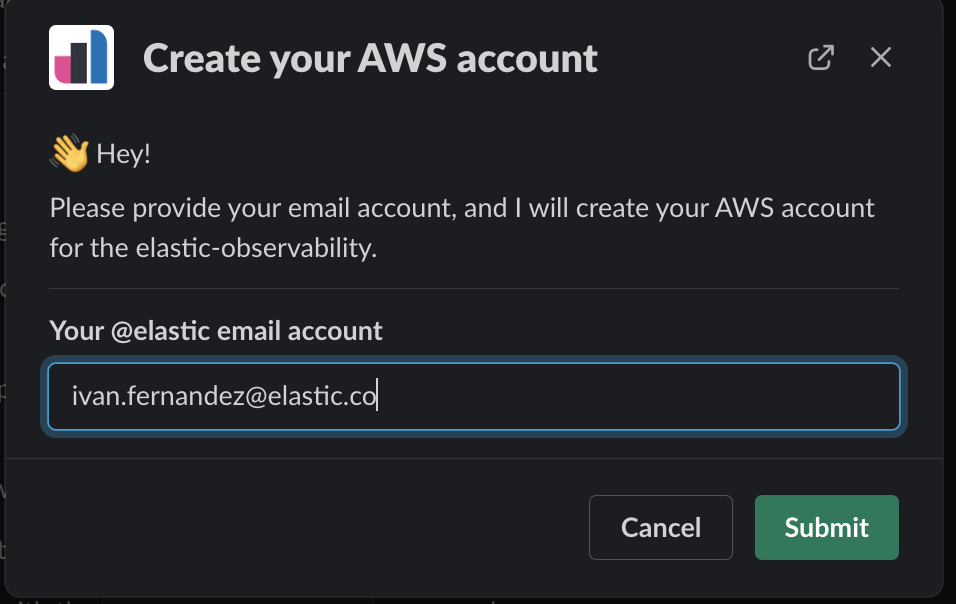{: style="width:450px"}

### /oblt-onboarding-ci

Enroll a new GitHub project in the CI.
A **modal window** on Slack to fill in a form.
A message in the private channel of the User about the Project is being onboarded.
The bot will prompt the user with the required parameters to onboard the GitHub project.

```shell
/oblt-onboarding-ci
```

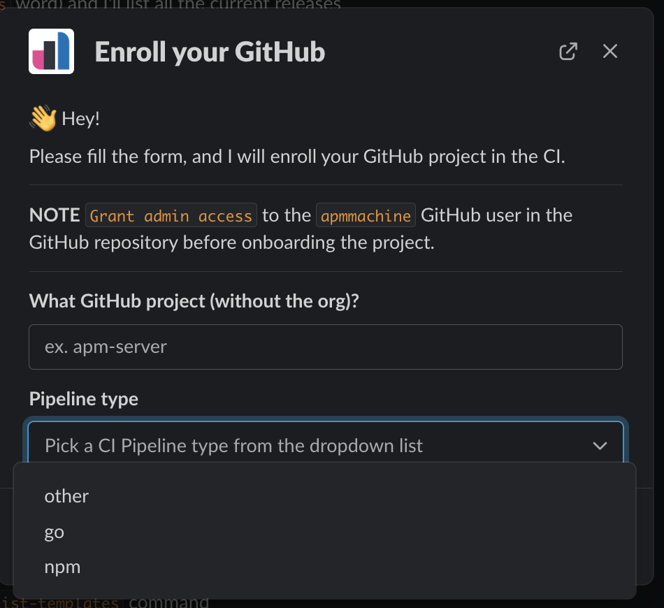{: style="width:450px"}

### /oblt-reset-aws

Reset your AWS account for the `elastic-observability` project.
A **modal window** on Slack to fill in a form.
A message in the private channel of the User about GitHub resetting the AWS account.
The bot will prompt the user with the required parameters to reset the AWS account.

```shell
/oblt-reset-aws
```

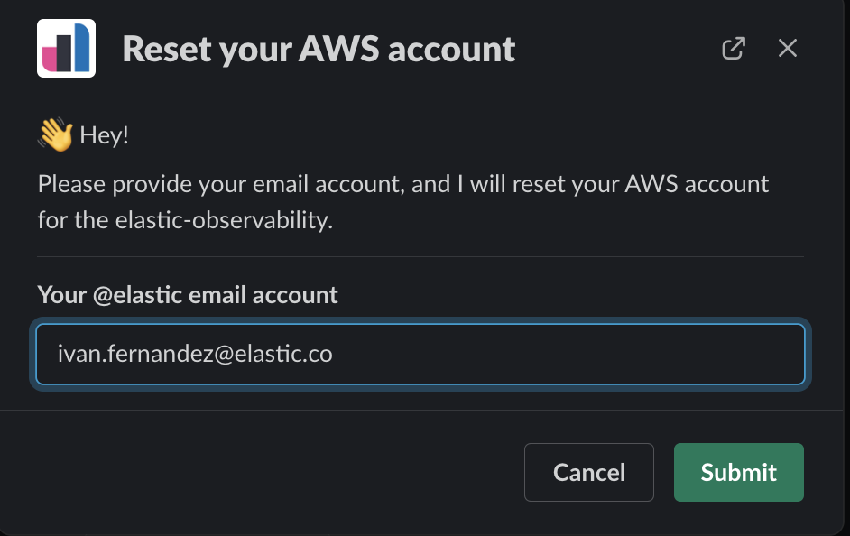{: style="width:450px"}

## Mentions

A mention in Slack means typing a username prepended by the `@` character.

The Slack bot has a few predefined responses when it's mentioned, always responding in the same channel it's mentioned, as a new message.

| Mention type | Response |
| ------------ | -------- |
| Message contains `active branches` | The bot will greet the user with `Hello` followed by the current active branches in the Unified Release. |
| Message contains `faq` or `know` | The bot will search in its existing FAQ database what it knows about that question. |
| Message contains `releases` | The bot will greet the user with `Hello` followed by the current list of releases/BCs in the Unified Release. |
| Message contains `snapshots` | The bot will greet the user with `Hello` followed by the current list of snapshots versions in the Unified Release. |
| Message contains `version` | The bot will greet the user with `Hello` followed by the details about the Slack Bot deployed version. |
| Message contains `help` | The bot will list the available commands. |
| Else | The bot will answer with a generic message: `I'm sorry, but I do not know how to respond on this. Please mention me with the 'help' word`. |

<sup><br>Made with ♥️ and ☕️ by 🤖.</sup>
