# Deploy my Kibana PR

What does `deploy-my-kibana` do? it is simply it takes the Kibana source code from a Pull-Request/Branch/Tag/commit,
compile it in a Docker image, publish it in our internal registry,
and finally deploy that Docker image in one of our Oblt tests cluster.

You can use three different approaches for Non Serverless:

* [Create a GitHub issue][] to deploy your own Kibana using the existing automation.
* `/oblt-deploy` in your Kibana PR, then the automation will create a GitHub issue similarly to the above one.
* [Oblt Deploy Kibana Browser Extension](https://github.com/elastic/oblt-deploy-kibana-browser-extension) to deploy Kibana in your PR with a simple button. This also creates a GitHub issue similarly to the above one.

You can use two different approaches for Serverless:

* [Create a GitHub issue for Serverless][] to deploy your own Serverless Kibana using the existing automation.
* Add `ci:project-deploy-observability` in your Kibana PR, then the automation will create a GitHub issue similarly to the above one.


Deployments are de-provisioned on Saturdays to avoid having too many Kibana instances running.

Only Elasticians PR are allow to deploy on those environments, any other PR will fail.

!!! Warning

    The PR can't be merged until the deployment is finished, otherwise the deployment will fail.

!!! Warning

    The deployment of your Kibana PR can take up to 40-50 minutes, so be patient.

## GitHub comment

You create a GitHub comment to deploy your Kibana PR.
To deploy your Kibana PR in ESS you have to use the GitHub comment `/oblt-deploy`.
To deploy your Kibana PR in ESS serverless you have to use the GitHub comment `/oblt-deploy-serverless`.

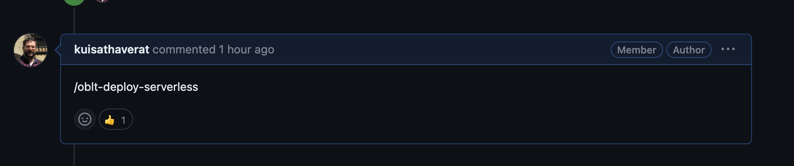{: style="width:600px"}

This will create a GitHub issue with the details of the deployment.
That issue will trigger the CI and the deployment will start.
For more details check how to deploy you Kibana PR with a [GitHub issue](#github-issue)

## GitHub issue

Another way to trigger the deploy of your Kibana Pr is by creating an issue in the [observability-test-environments](https://github.com/elastic/observability-test-environments/issues/new?assignees=&labels=cluster,deploy-custom-kibana&template=cluster-deploy-custom-kibana-issue.yaml&title=[Deploy+Kibana]:+) repository.

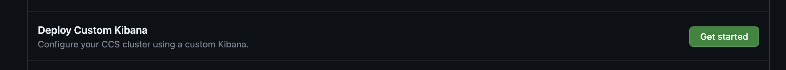{: style="width:600px"}

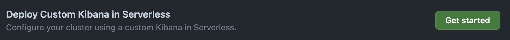{: style="width:600px"}

These special issues will trigger the CI and the deployment will start.

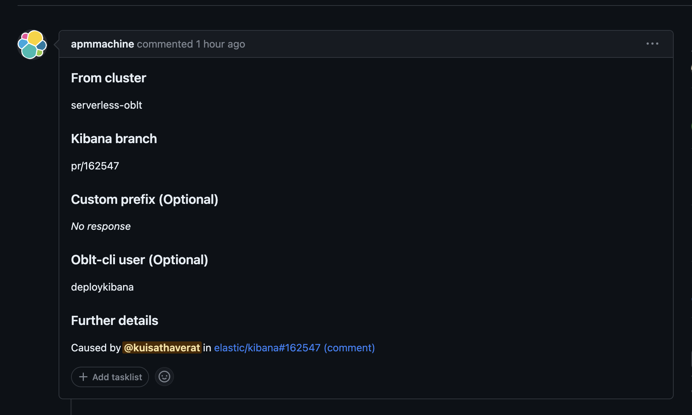{: style="width:600px"}

After you comment, an issue is created for you to follow the deployment progress.

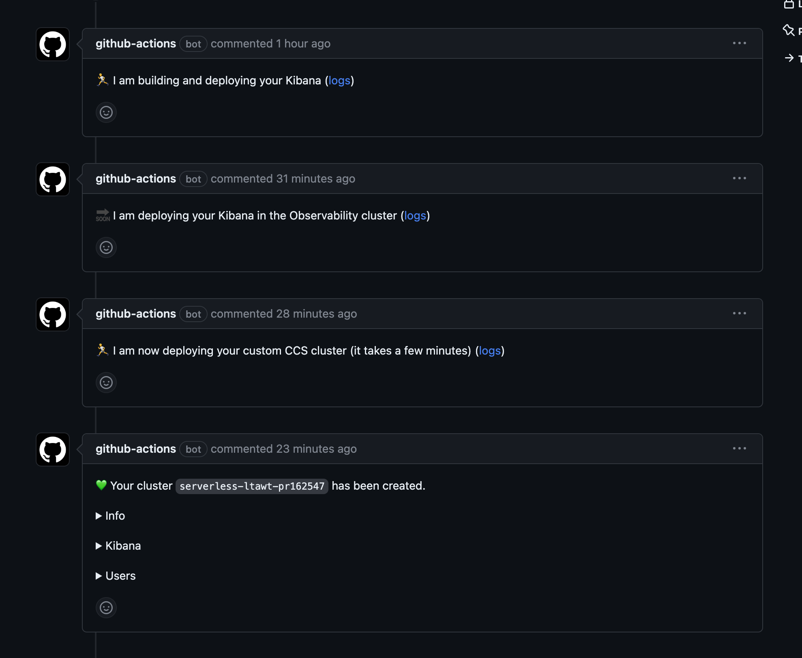{: style="width:600px"}

Finally, you will have the credentials to access the issue and on the #observablt-bots Slack channel.

{: style="width:600px"}

From there, you can start testing your deployment.

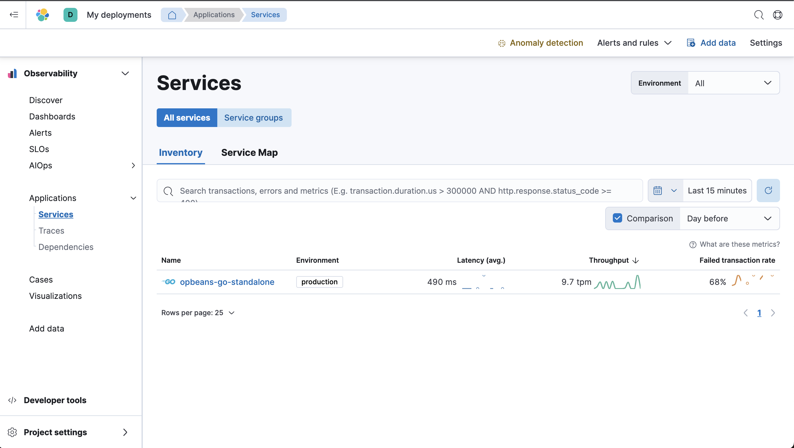{: style="width:600px"}

## Deploy a commit from main

If you want to deploy a commit from the `main` branch you can use the Docker image generated by that commit.
The Docker image is published in the Elastic Docker registry `docker.elastic.co/kibana-ci/kibana:git-123456789012` and `docker.elastic.co/kibana-ci/kibana-serverless:git-123456789012`, where `123456789012` are the 12 first characters of the commit SHA.

## Troubleshooting

In case of any issue, you can check the logs of the CI build.
The issue created will contain the link to the CI.

{: style="width:600px"}

In the summary of each CI build you have links to the logs of the deployment.
There are two kind of logs, one for the deployment of the cluster(Terraform) and another one for the deployment of the Elastic Stack.

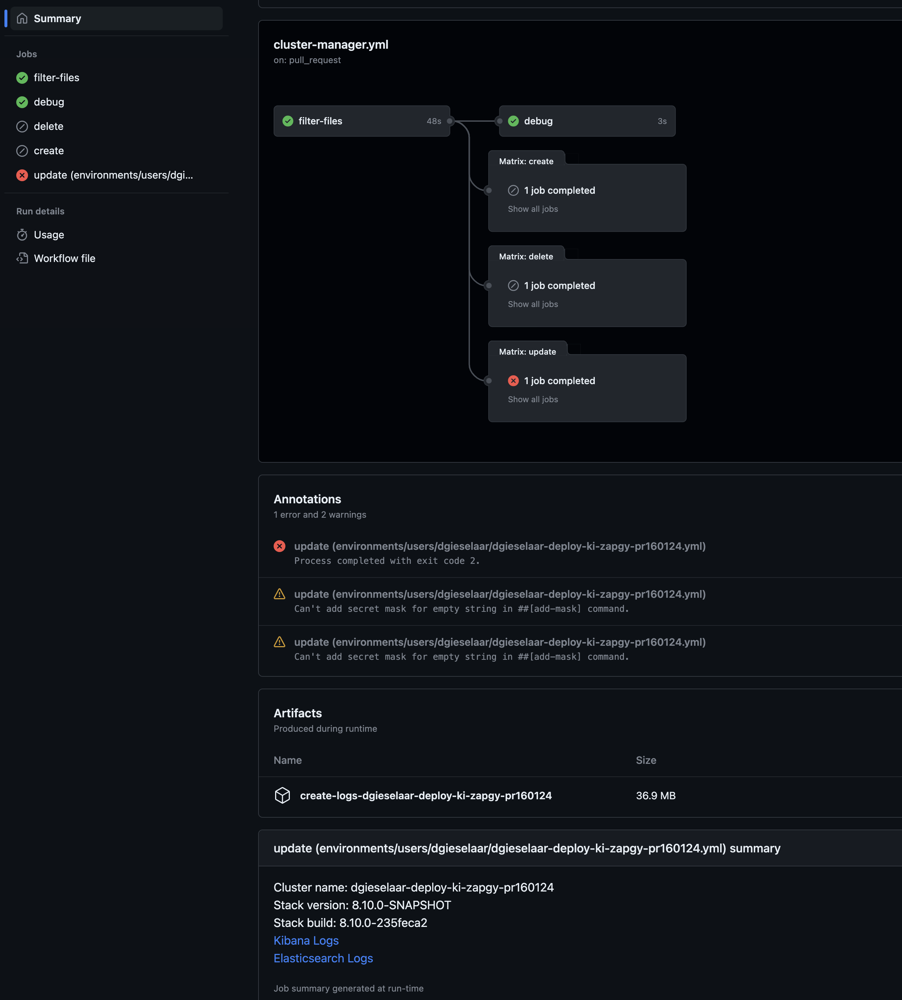{: style="width:600px"}

If you check the Kibana and Elasticsearch logs you can find issues related to settings of other issues related to the new feature you are developing.

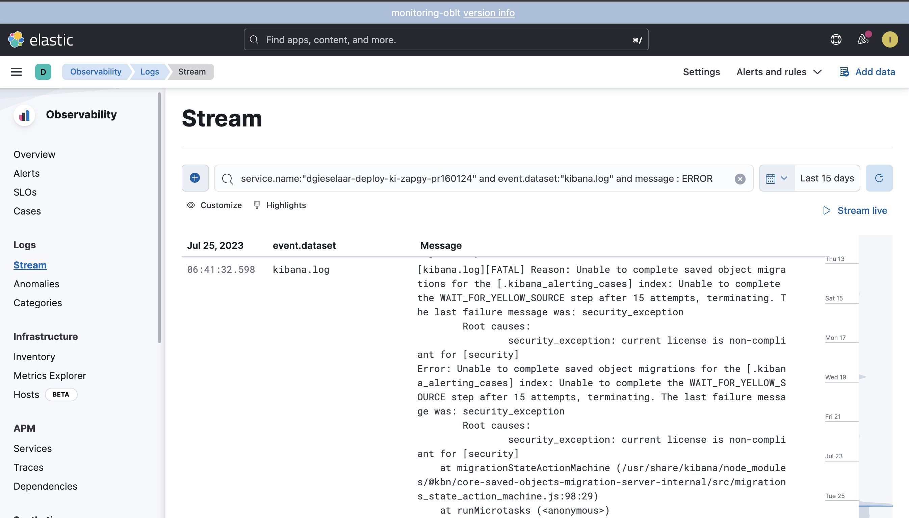{: style="width:600px"}

If you download the zip file on artifacts you will check the Terraform logs and the issues related to deploy on ESS.

## Connect to my Kibana

When the build finished the details to connect are posted in the `Slack channel #observablt-bots` and also in the just created GitHub issue.

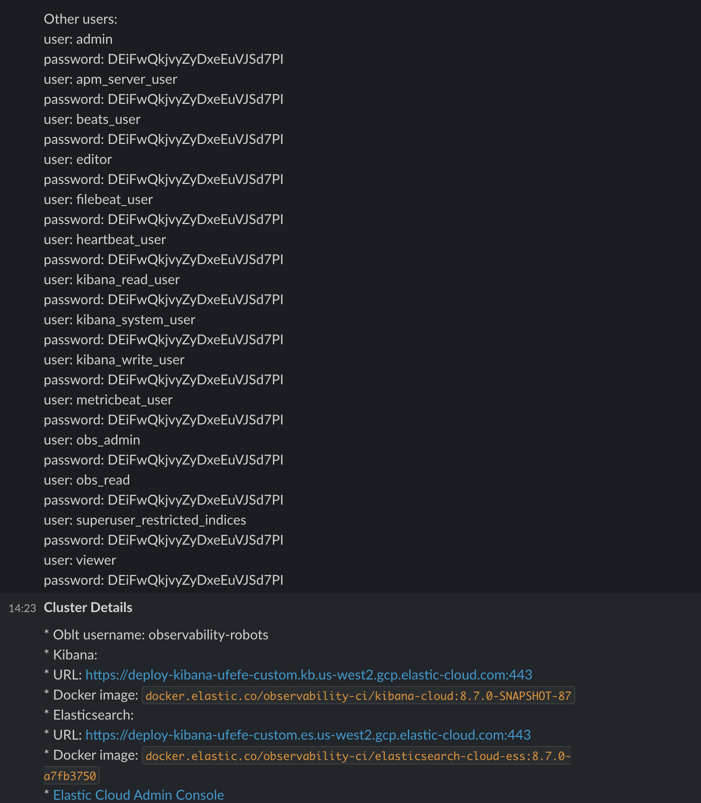{: style="width:600px"}

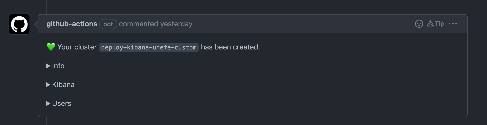{: style="width:600px"}

* Kibana URL: The URL of your deploy, TLS certificates take a little to be generated so your browser can complain about the website certificate, ignore it.
* Docker image: this is the name and tag of the generated Docker image you can use it locally.
* Elastic Cloud Admin Console: This is the link to the Admin console on ESS
* Cluster logs: when observability is enabled this link contains the logs
* Stack Monitoring: when observability is enabled this link will show the cluster Stack Monitoring data, you can search by your cluster name.
* Help: link to this page.
* List of users : This is the list of users+password you can to use to access to you Kibana.

## Where are the Docker images published?

The Docker images are published on our Docker registry `docker.elastic.co`.

### No Serverless

The namespace we use for the CI `observability-ci`.

The name of the docker image is `kibana-cloud`, so all together `docker.elastic.co/observability-ci/kibana-cloud`.

The last part of the Docker image is the tag, this tag is auto generated from the `kibana_branch` parameter.
The commit SHA of the source code is also used as tag so both are valid tags.
In the following example we have build the `kibana_branch=PR/91658` and those are the Docker images published:

```
docker.elastic.co/observability-ci/kibana-cloud:5b88add4ffff4deb3f0f1279d497968856a7921d
docker.elastic.co/observability-ci/kibana-cloud:pr91658
docker.elastic.co/observability-ci/kibana-cloud:8.8.0-SNAPSHOT-5b88add4ffff4deb3f0f1279d497968856a7921d
docker.elastic.co/observability-ci/kibana-cloud:8.8.0-SNAPSHOT-pr91658
```

You can see the Docker images deployed in the logs of the GitHub action

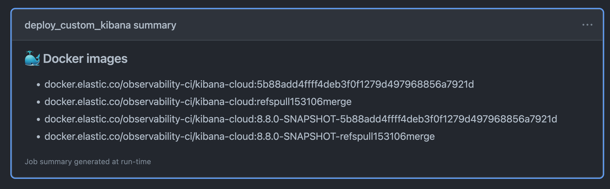{: style="width:600px"}

### Serverless

The namespace we use for the CI is `kibana-ci`.

The name of the docker image is `kibana-serverless`, so all together `docker.elastic.co/kibana-ci/kibana-serverless`.

The last part of the Docker image is the tag, this tag is auto generated using the PR number and commit SHA.

```
docker.elastic.co/kibana-ci/kibana-serverless:pr-181041-53f065668d64
```

## Feedback

Any feedback is welcome, don't be shy. If you see improvements, bug, or anything else you thing is interesting
please open an issue on the [observability-test-environments](https://github.com/elastic/observability-test-environments/issues) repository.


[Create a GitHub issue]: https://ela.st/deploy-my-kibana-oblt
[Create a GitHub issue for Serverless]: https://ela.st/deploy-my-serverless-kibana-oblt
