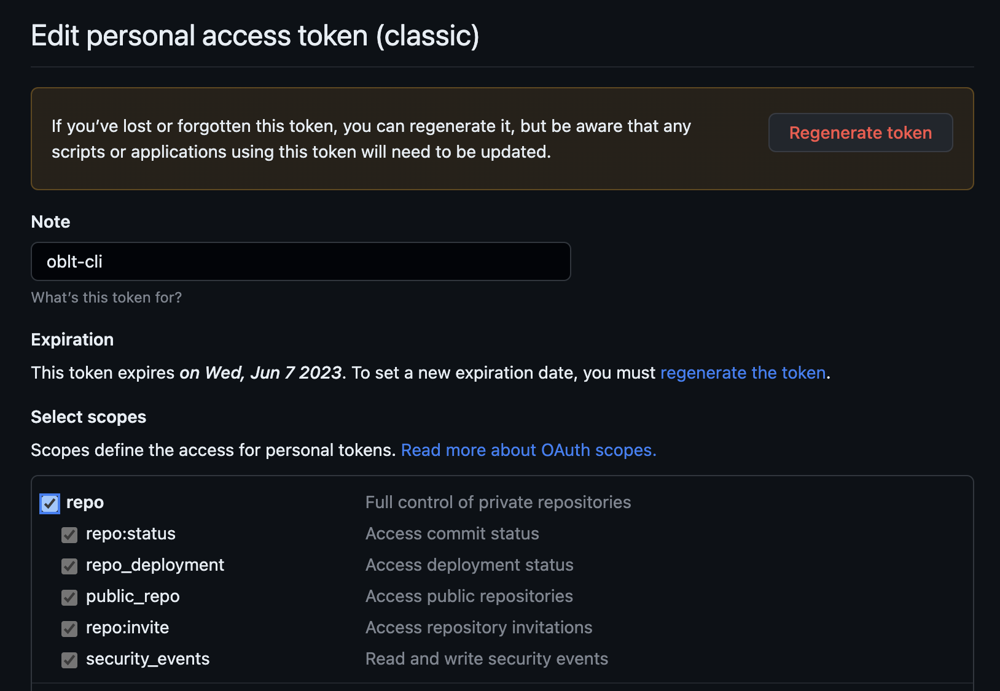
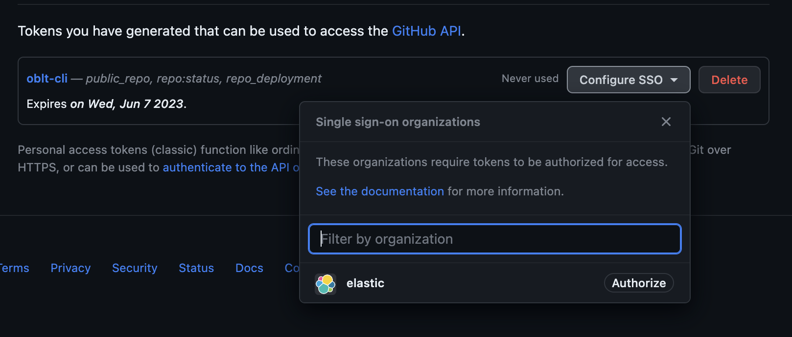

# GitHub Token for oblt-cli

## GitHub Token (classic)

Some `oblt-cli` operations require a GitHub token to be passed as an argument of environment variable `GITHUB_TOKEN`.
This GitHub token is used to download the artifacts from the private repository or make checkouts.
The oblt clusters use a private repository inside the Elastic organization.
Thus the GitHub token must have the `repo` scope and SSO enabled.
Only the `Tokens (classic)` GitHub token is supported.

GitHub token permissions:

{: style="width:450px"}

Configure SSO:

{: style="width:450px"}

For more details about how to [create a GitHub Token check the GitHub documentations](https://docs.github.com/en/authentication/keeping-your-account-and-data-secure/creating-a-personal-access-token).

## GitHub Token (gh)

As alternative you can use [gh](https://cli.github.com/) to get the current GitHub token configured in your gh session:

```shell
export GITHUB_TOKEN="$(gh auth token)"
```

This token has the same permissions you have configured in your gh session.
This token is not stored anywhere and is only used to download the artifacts from the private repository or make checkouts.

For more details see [gh auth token](https://cli.github.com/manual/gh_auth_token)
