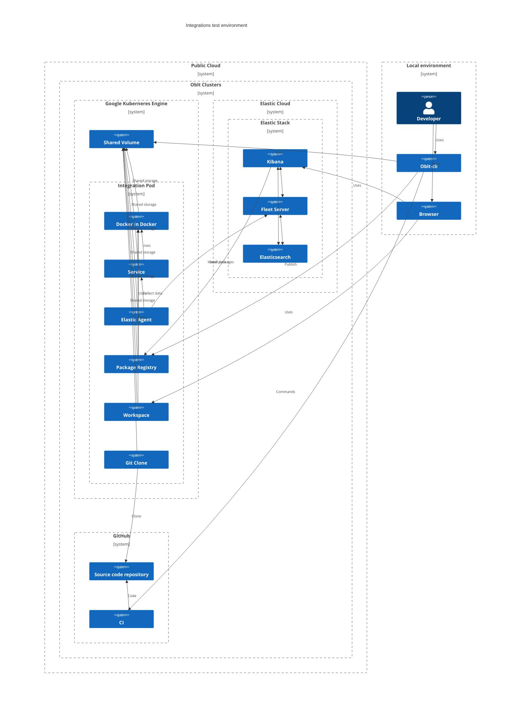
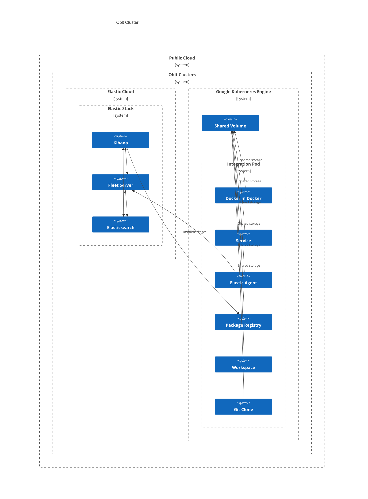

# Integrations (Experimental)

Integrations allow to collect data from different sources and send it to the Elastic Stack.
The Elastic Agent is in charge to launch integration using a policy configured in Kibana.
The policy settings describe how to collect data from the source and how to send it to the Elastic Stack.
Test an integration require launch the Elastic Stack, the service to be monitored and the Elastic Agent.
This infrastructure require also an Elastic Registry to publish the versions of the integration we want to test.
To make this process easier and Cloud First Testing ready, we have integrate the process in `oblt-cli`.



## Create a cluster

The first step is create a cluster using `oblt-cli packages cluster create` command.
This command will create a ESS cluster, and a GKE cluster with the required resources to run the integration.
The ESS Cluster will deploy the Elastic Stack in the versions specified in the command.
In the GKE cluster will be created a pod with the integration, the Elastic Agent and some tooling containers.

```bash
oblt-cli packages cluster create \
  --integration microsoft_sqlserver \
  --stack-version "8.7.0"
```



## Publish the integration

The next step is publish the integration in the package registry.
This step is required to make the integration available for the Elastic Agent.
The integration is published in the package registry using `oblt-cli package publish` command.
This command will publish the integration in the package registry of the Oblt cluster.

```bash
oblt-cli package publish --cluster-name "ess-integrations-mizmm-custom" --package-folder "/Users/myUser/src/integrations/packages/microsoft_sqlserver"
```

This command will check, test, build, and publish the integration in the package registry.

## Show containers logs

The integration is deployed in a pod that contains several containers.
It is possible to show the logs of the containers using `oblt-cli packages logs` command.

```bash
oblt-cli packages logs service --cluster-name "ess-integrations-mizmm-custom"
```

```bash
oblt-cli packages logs elastic-agent --cluster-name "ess-integrations-mizmm-custom"
```

Finally, it is possible to synchronize the logs folders from the pod to a local folder every 10 seconds,
that local folder is the point that the local Elastic Agent has to listen for the logs.

```bash
CLUSTER_NAME=ess-integrations-v2-oferv
LOCAL_FOLDER=/tmp/logs
oblt-cli packages logs remote --cluster-name "${CLUSTER_NAME}" --output-folder "${LOCAL_FOLDER}"
```

Check the help of the command to see the available options.

```bash
oblt-cli packages logs --help
```

## Access to containers

It is possible to access to the containers using `oblt-cli packages shell` command.
An shell iterative session will be open in the container.

```bash
obl-cli packages shell service --cluster-name "ess-integrations-mizmm-custom"
```

```bash
obl-cli packages shell elastic-agent --cluster-name "ess-integrations-mizmm-custom"
```

Check the help of the command to see the available options.

```bash
oblt-cli packages shell --help
```

## Destroy the cluster

When you finish the test, you can delete the cluster using `oblt-cli packages cluster destroy` command.

```bash
oblt-cli packages cluster destroy --cluster-name "ess-integrations-mizmm-custom"
```

## Using the VSCode directly on the cluster

One of the container deployed in the pod is a VSCode container.
It is possible to use the VSCode directly on the cluster.
To do that, you need to open a tunnel to the pod using `oblt-cli packages vscode` command.

```bash
oblt-cli packages vscode --cluster-name "ess-integrations-mizmm-custom"
```

This command will open a tunnel to the pod and will open the VSCode in the browser.
The containers has all the tools required to develop the integration.

## Forward integrations ports

In the integrations pod is deployed a container with the service target of the integration.
The service exposed a service/s in a port/s.
It is possible to forward the ports of the service/s to the local machine using `oblt-cli packages ports` command.

```bash
oblt-cli packages ports --cluster-name "ess-integrations-mizmm-custom"
```

## List integrations available

The integrations project has many integrations.
It is possible to list the integrations available using `oblt-cli packages list` command.

```bash
oblt-cli packages list
```

## Force re-authenticate

The `oblt-cli packages` needs to authenticate in the Oblt cluster in order access the GKE cluster.
The authentication is done using the `gcloud` command.
The `oblt-cli packages` will try to authenticate using the credentials of the `gcloud` command.
The `oblt-cli packages` try to authenticate only once, because of that the authentication can expire.
When the authentication expire, the `oblt-cli packages auth` command can be used to force the authentication.

```bash
oblt-cli packages auth --cluster-name "ess-integrations-mizmm-custom"
```
