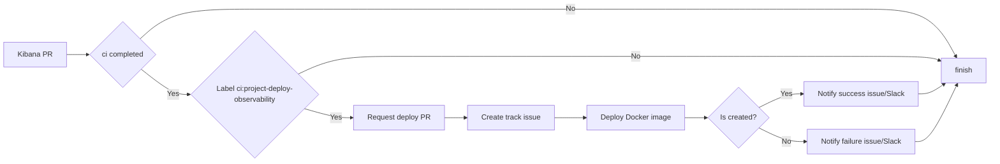

## Deploy PRs

The Kibana repository has a GitHub Action that deploys the PRs to a serverless cluster.
This automation is triggered by the label `ci:project-deploy-observability` on the PR.
When the PR has the label `ci:project-deploy-observability`, the GitHub Action will create an issue in the [observability-test-environments][] repository to deploy the PR.
The issue is used to track the process of the creation and share the credentials.



## Automatic destroy

The serverless cluster is destroyed automatically after 3 days of the deployment.
The cluster is destroyed to save resources and avoid costs.
If the PR is closed/merged before the 3 days, the cluster is destroyed immediately.
Finally every Saturday, the serverless cluster is destroyed to avoid costs during the weekend.

[observability-test-environments]: https://github.com/elastic/observability-test-environments
