# Check the logs/Metrics/APM

Each oblt cluster stores the observability data (log, metrics, traces) of the infrastructure and the applications deployed.
We have two types of data Elastic Stack monitoring and other deployments data.

* [Accessing cluster Elastic Stack logs/Metrics/APM](#accessing-cluster-elastic-stack-logsmetricsapm)
* [Accessing cluster Apps logs/Metrics/APM](#accessing-cluster-apps-logsmetricsapm)

## Accessing cluster Elastic Stack logs/Metrics/APM

The Elastic Stack observability data is send to [monitoring-oblt][].

[monitoring-oblt][] is an oblt cluster for collect APM, logs, and metrics
form the Elastic Stack of all our deployments. This data includes:

* Elasticsearch logs, metrics, and APM.
* Kibana logs, Metrics, and APM.

For more details how to Stack Monitoring works check:

* [Stack Monitoring](https://www.elastic.co/guide/en/kibana/current/xpack-monitoring.html)
* [Monitor a cluster](https://www.elastic.co/guide/en/elasticsearch/reference/current/monitor-elasticsearch-cluster.html)

### Elastic Stack Logs

You can find the logs of any oblt cluster at [Monitoring logs](https://monitoring-oblt.kb.us-west2.gcp.elastic-cloud.com/app/logs/), there you can filter by any field, for example service name and event dataset `service.name :"dev-oblt" and event.dataset :"kibana.log"`.

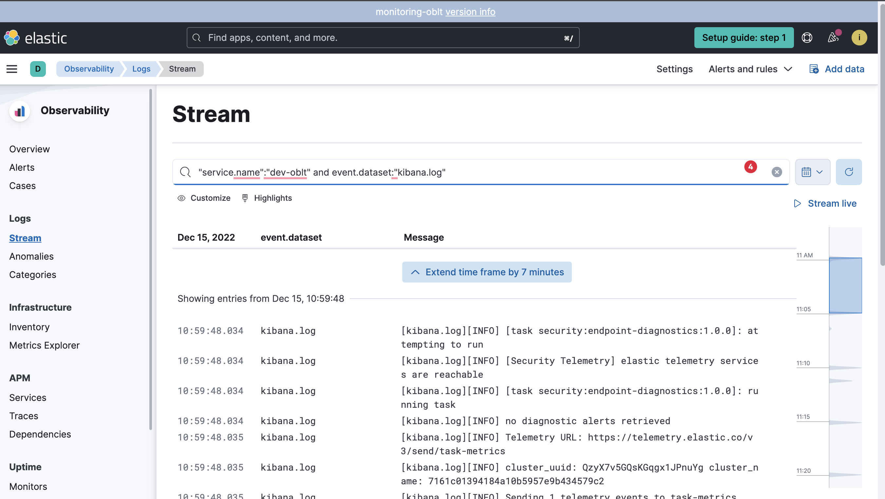{: style="width:600px"}

### Elastic Stack Metrics

You can find the metrics of any oblt cluster at [Stack Monitoring](https://monitoring-oblt.kb.us-west2.gcp.elastic-cloud.com/app/monitoring), there you can filter by cluster name, and check the metrics of each part of the Elastic Stack.

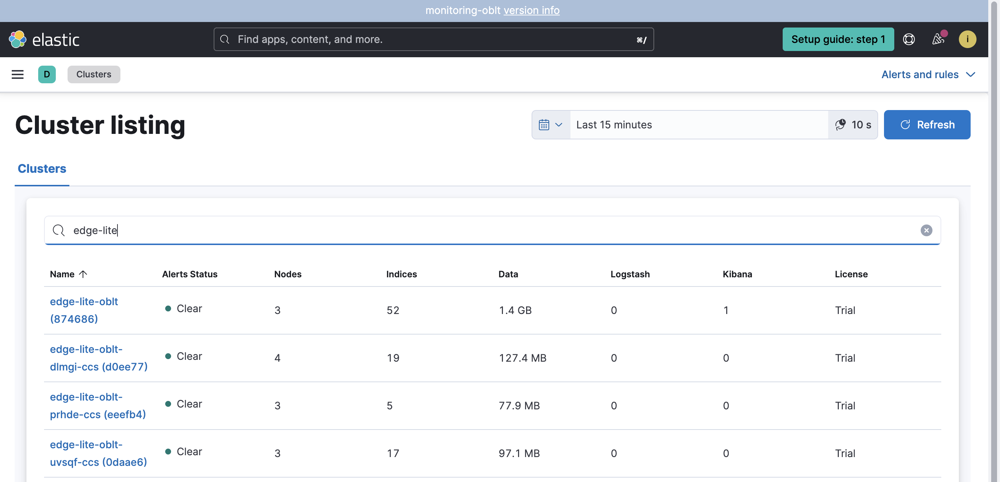{: style="width:600px"}

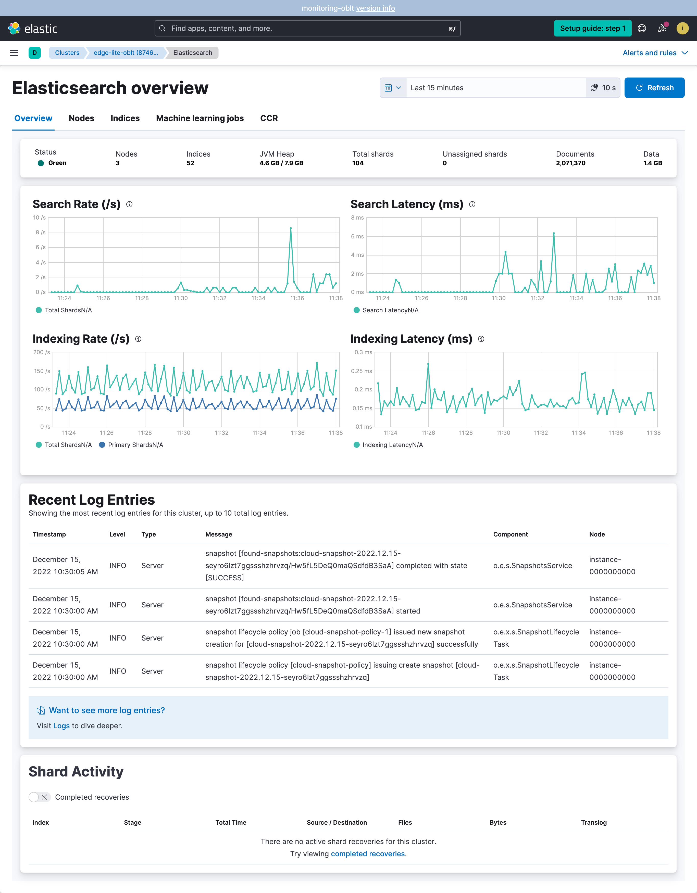{: style="width:600px"}

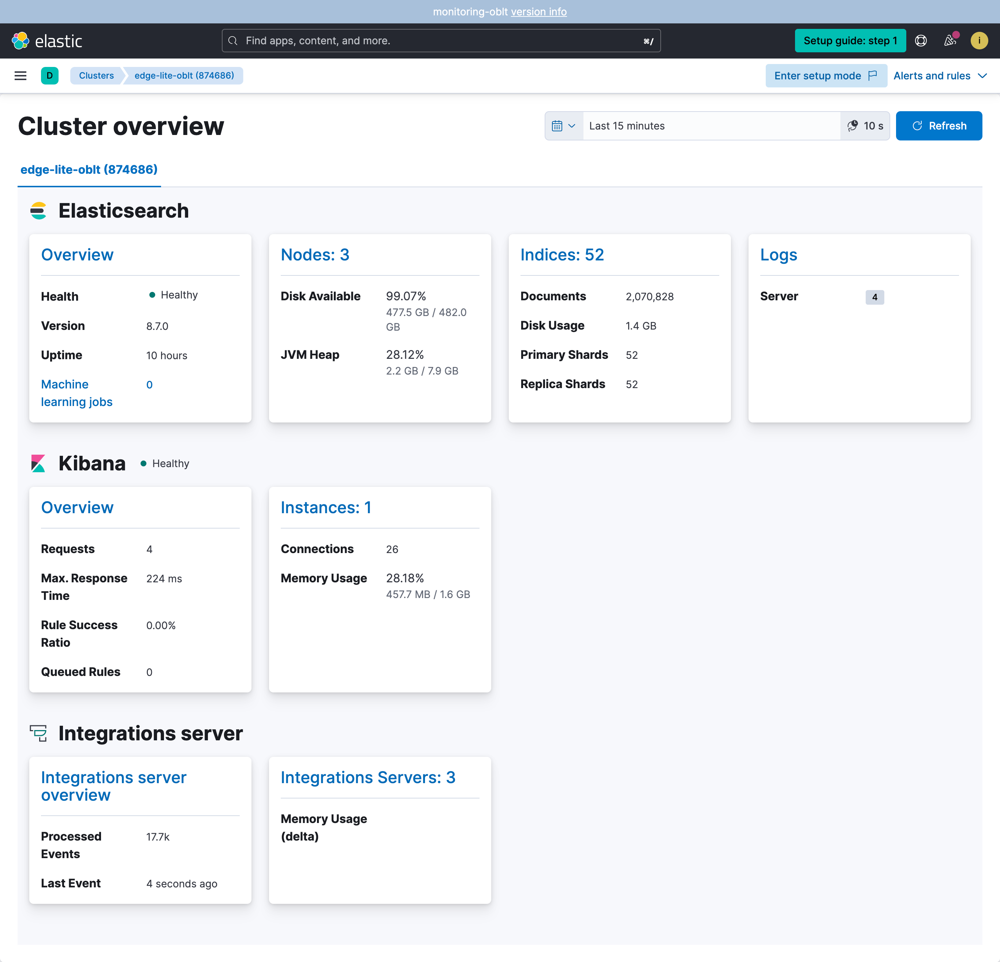{: style="width:600px"}

### Elastic Stack APM

You can find the APM data of any oblt cluster at [Monitoring APM](https://monitoring-oblt.kb.us-west2.gcp.elastic-cloud.com/app/apm/services), there you can filter by cluster by any field, for example `labels.deploymentName : "dev-oblt"`.

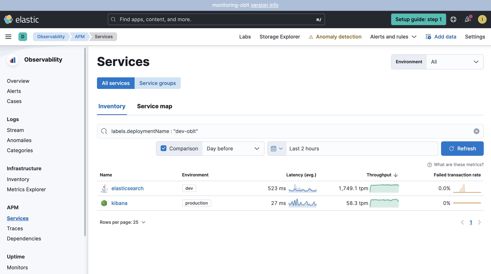{: style="width:600px"}

### Elastic Stack User experience

You can find the UX data of any oblt cluster at [Monitoring UX](https://monitoring-oblt.kb.us-west2.gcp.elastic-cloud.com/app/ux), there you can filter for the deployment URL.

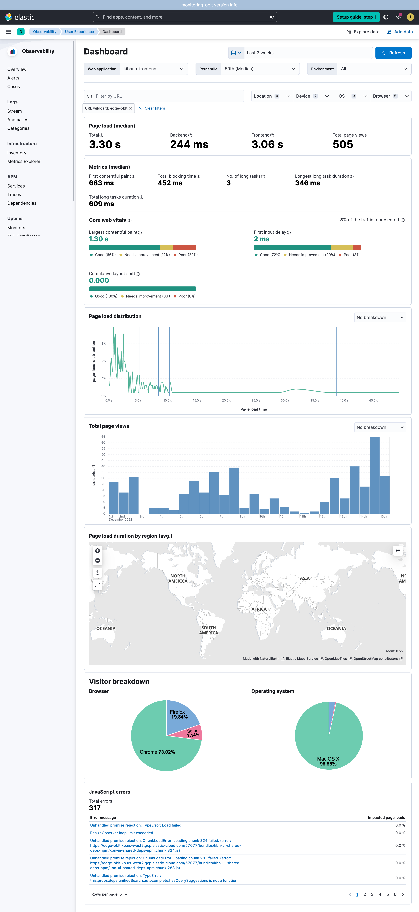{: style="width:600px"}

## Accessing cluster Apps logs/Metrics/APM

Oblt cluster deploy a Kubernetes cluster and several applications.
Each oblt clusters collect it own Kubernetes logs and metrics.
Each application is deployed as a Kubernetes pod,
we collect log and metrics of every pod.
Some of the pods also report APM data.

For more details about observability check [What is Elastic Observability?](https://www.elastic.co/guide/en/observability/current/observability-introduction.html)

### cluster Apps Logs

To check the logs of any pod deploy you have to go to logs in the oblt cluster,
for example for edge-lite-oblt the URL is `https://edge-lite-oblt.kb.us-west2.gcp.elastic-cloud.com/app/logs/`.
In the logs app you can filter for any field, for example `kubernetes.pod.name :"opbeans-java-7fddb79564-dzwgk"`
or `"service.name":"opbeans-java"`.

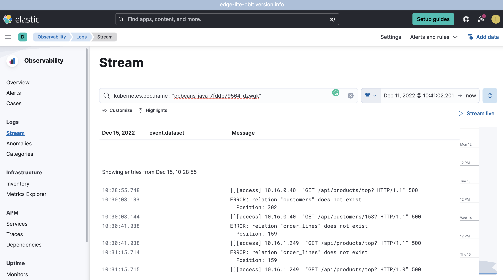{: style="width:600px"}

### cluster Apps Metrics

To check the metrics of any pod deploy you have to go to inventory in the oblt cluster,
for example for edge-lite-oblt the URL is `https://edge-lite-oblt.kb.us-west2.gcp.elastic-cloud.com/app/metrics/inventory`.
In the inventory app you can filter for any field, for example `kubernetes.pod.name :"opbeans-java-7fddb79564-dzwgk"`

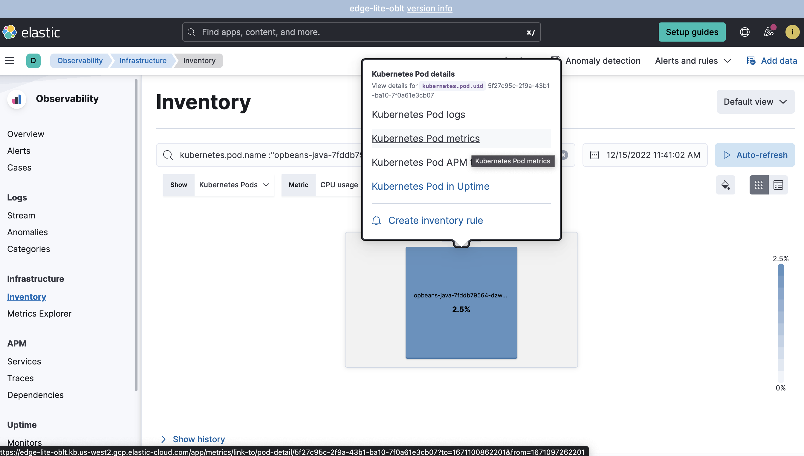{: style="width:600px"}

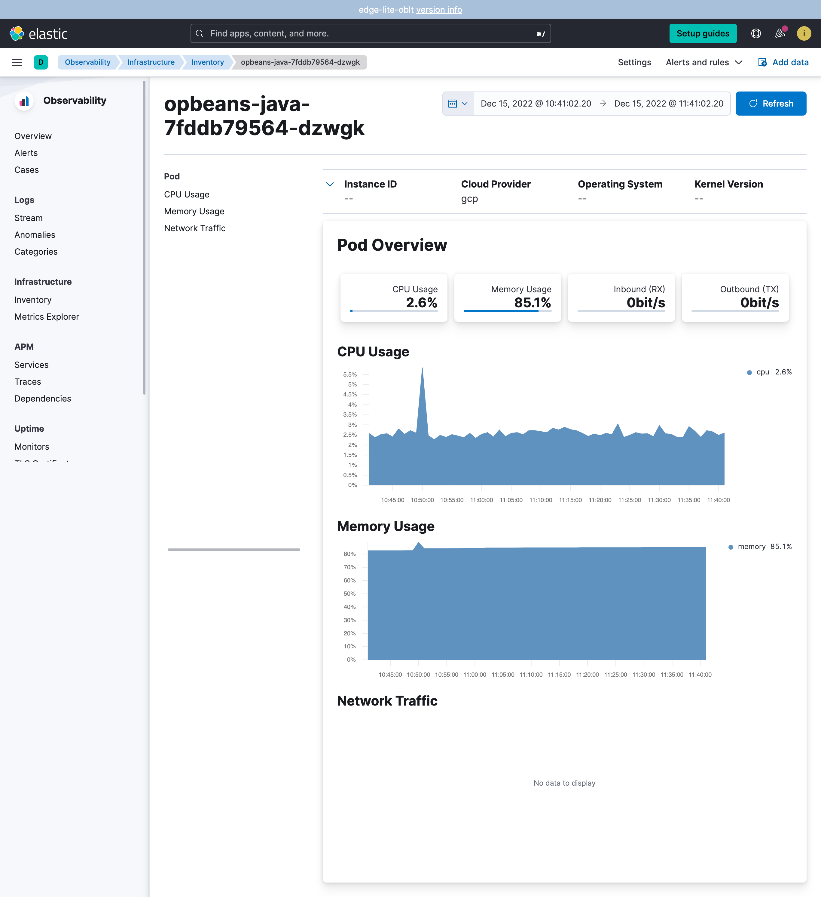{: style="width:600px"}

### cluster Apps APM

To check the APM data of any pod deploy you have to go to APM in the oblt cluster,
for example for edge-lite-oblt the URL is `https://edge-lite-oblt.kb.us-west2.gcp.elastic-cloud.com/app/apm/services`.
There you can select the service you want to explore.

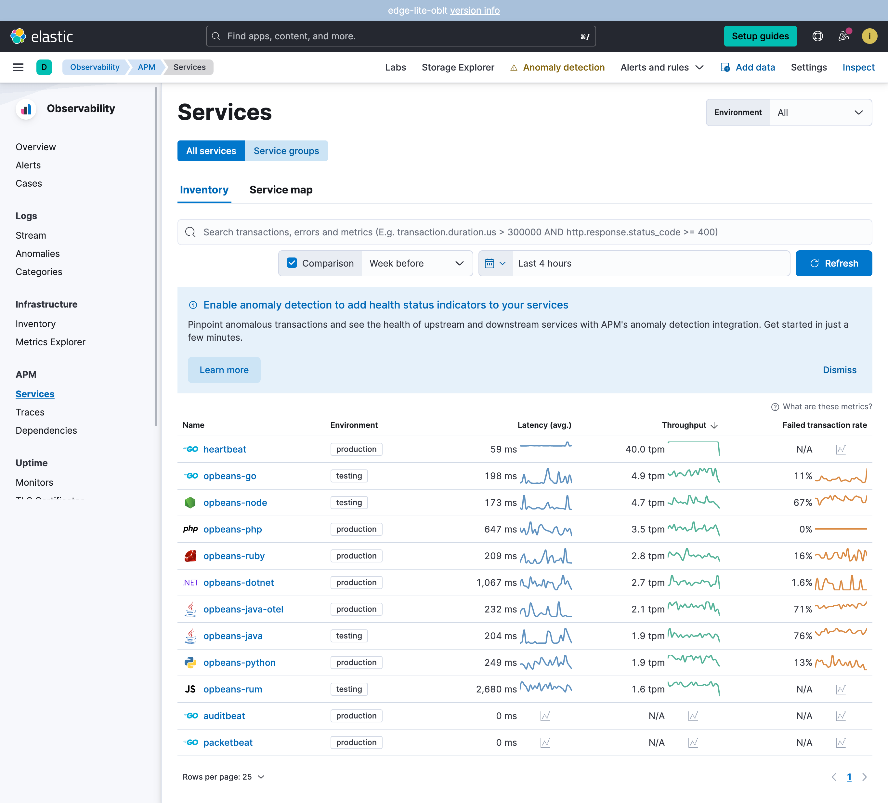{: style="width:600px"}

### cluster Apps User experience

To check the UX data of any pod deploy you have to go to UX in the oblt cluster,
for example for edge-lite-oblt the URL is `https://edge-lite-oblt.kb.us-west2.gcp.elastic-cloud.com/app/ux`,
there you can filter for an URL.

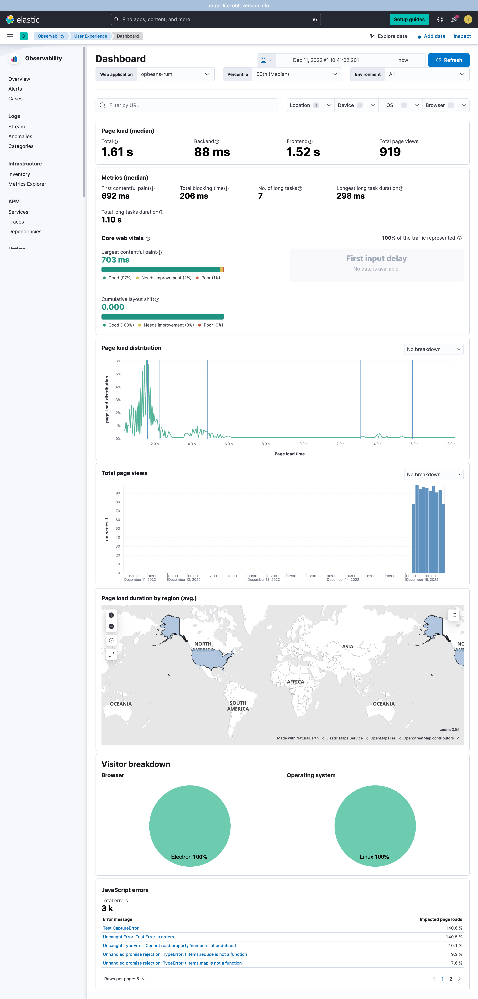{: style="width:600px"}

## Use Regional Logging Cluster

ESS has a regional logging cluster that collects logs from all the deployments.
Check [Collect Kibana logs and diagnostics][] to know how to access the logs.

[Collect Kibana logs and diagnostics]: https://github.com/elastic/observability-dev/blob/main/docs/how-we-work/collect-kibana-logs-and-diagnostics.md
[monitoring-oblt]: https://monitoring-oblt.kb.us-west2.gcp.elastic-cloud.com
