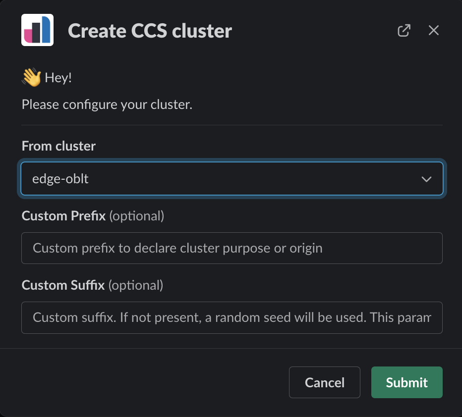

# Creating a new cluster

## CCS clusters

* [Create a GitHub issue for a CCS cluster][], to create your own CCS cluster automatically.
* [How to create a cluster using Slack](#how-to-create-a-cluster-with-slack)
* [How to create a cluster with oblt CLI](#how-to-create-a-cluster-with-oblt-cli)
* [How to create a cluster locally](#how-to-create-a-cluster-locally)
* [How to create a longterm cluster](#how-to-create-a-longterm-cluster)

## Generic clusters

* [Create a GitHub issue for a Generic cluster][], to create your own Generic cluster automatically.
* [How to create a cluster with oblt CLI](#how-to-create-a-cluster-with-oblt-cli)
* [How to create a cluster locally](#how-to-create-a-cluster-locally)
* [How to create a longterm cluster](#how-to-create-a-longterm-cluster)

## How to

### How to create a cluster with Slack

The fastest and easiest way to create an oblt cluster is using the [oblt robot][oblt-robot] Slack bot,
you do not need to install anything, you interact with a Slack robot directly in the Slack app.

* Go to the `#observablt-bots` Slack channel
* Write the comment `/create-ccs-cluster`
* Choose the remote cluster to connect by CCS.

{: style="width:450px"}

* Wait for the bot to send you the credentials By Slack.

For more commands and info check the documentation at [oblt robot][oblt-robot]

### How to create a cluster with oblt CLI

If you preferred the command line to create an oblt cluster,
you can use [oblt CLI][oblt-cli].

* [Install oblt-cli][oblt-cli-install]
* [Configure oblt CLI for first time][oblt-cli-configure]
* Create your first CCS cluster

```bash
oblt-cli cluster create ccs --remote-cluster edge-oblt
```

* Wait for the CI to send you the credentials By Slack.

For more commands and info check the documentation at [oblt CLI][oblt-cli]

#### Create cluster with a specific version of Elastic Stack

```bash
oblt-cli cluster create ess --stack-version 8.7.0-SNAPSHOT
```

```bash
oblt-cli cluster create ess --stack-version 8.6.0
```

#### Create cluster with a specific Docker image version of Elastic Stack

```bash
oblt-cli cluster create custom --template ess --parameters '{"StackVersion": "8.6.0", "ElasticsearchDockerImage": "docker.elastic.co/observability-ci/elasticsearch-cloud:8.6.0-75d87829", "KibanaDockerImage": "docker.elastic.co/observability-ci/kibana-cloud:8.6.0-75d87829", "ElasticAgentDockerImage": "docker.elastic.co/observability-ci/elastic-agent-cloud:8.6.0-75d87829"}'
```

### How to create a cluster Manually

In the git repository `https://github.com/elastic/observability-test-environments`
there is a folder `environments/users/USERNAME` that contains a folder per environment.
Every environment folder will have a cluster configuration file per cluster we want to create,
so to create a new cluster we will need to create a new user environment folder (if there is no any) and cluster configuration file.
This are the steps to follow:

* Pre-requisites
  * Git installed
  * Python3 installed
  * [Google Cloud Secrets Manager][] access
* Checkout the repo `git@github.com:elastic/observability-test-environments.git`
* Create a new folder at `environments/users/USERNAME` for the user's cluster.
* Create a new `my-config-cluster.yml`
* Edit the `config-cluster.yml` file to set your environment configuration.
* Create a feature branch and push your changes to the repo
* Create a new PR
* The [CI will trigger a new build][oblt-manager] to create the new cluster based in your cluster configuration file.

You have examples of configuration at [test configurations](https://github.com/elastic/observability-test-environments/tree/main/tests/environments)

### How to create a cluster locally

Sometimes we need to create the cluster without using the CI,
for those cases we can run the same commands the CI uses.

* Pre-requisites
  * Git installed
  * Python3 installed
  * [Google Cloud Secrets Manager][] access
* Checkout the repo `git@github.com:elastic/observability-test-environments.git`
* Create a new folder at `environments/users/USERNAME` for the user's cluster.
* Create a new `my-config-cluster.yml`
* Edit the `config-cluster.yml` file to set your environment configuration.
* Execute the `create-cluster` target

```bash
CLUSTER_CONFIG_FILE=$(pwd)/environments/USERNAME/my-config-cluster.yml \
make -C ansible create-cluster
```

When you finish with the cluster, if you do not push the changes to the repo,
you must destroy the cluster.

```bash
CLUSTER_CONFIG_FILE=$(pwd)/environments/USERNAME/my-config-cluster.yml \
make -C ansible destroy-cluster
```

You have examples of configuration at [test configurations](https://github.com/elastic/observability-test-environments/tree/main/tests/environments)

### How to create a longterm cluster

* Pre-requisites
  * Git installed
  * Python3 installed
  * [Google Cloud Secrets Manager][] access
* Checkout the repo `git@github.com:elastic/observability-test-environments.git`
* Create a new folder at `environments/users/robots/CLUSTER_NAME` for the user's cluster.
* Create a new `config-cluster.yml`
* Copy `environments/users/robots/edge-oblt/Makefile` to `environments/users/robots/CLUSTER_NAME`
* Edit the `config-cluster.yml` file to set your environment configuration.
* Create a feature branch and push your changes to the repo
* Create a new PR
* The [CI will trigger a new build][oblt-manager] to create the new cluster based in your cluster configuration file.

It is possible to create the cluster using Ansible from local

```bash
make -C environments/users/robots/CLUSTER_NAME create-cluster
```

[Google Cloud Secrets Manager]: https://cloud.google.com/secret-manager/docs
[oblt-manager]: https://github.com/elastic/observability-test-environments/actions/workflows/cluster-manager.yml
[oblt-cli]: http://ela.st/oblt-cli
[oblt-robot]: https://ela.st/oblt-robot
[oblt-cli-install]: http://ela.st/oblt-cli#installation
[oblt-cli-configure]: http://ela.st/oblt-cli#configure
[Create a GitHub issue for a CCS cluster]: https://ela.st/create-ccs-oblt
[Create a GitHub issue for a Generic cluster]: https://ela.st/create-generic-oblt
