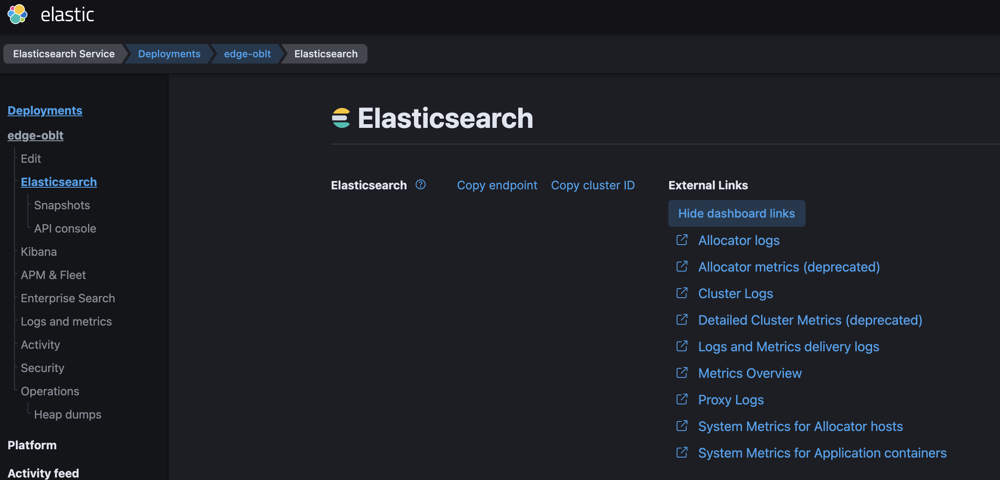

# Access to ESS deployments

## Accessing the test clusters

Our oblt clusters are deployed in the [ESS production environment](https://cloud.elastic.co/deployments/).
This environment is a shared environment used for testing.
This environment has two ways to login, the admin console and the ESS platform.
For ephemeral deployments and test we use the [ESS staging environment](https://staging.found.no/home).

## Access to production environment

### Admin console

The URL to access to the ESS production admin console is `https://admin.foundit.no`.
All Elasticians can access to the ESS staging admin console by using the SSO,
however this kind of access does not allow the use of all administrative operations
over the clusters, some needs a higher permissions.

### User UI

The URL to access is  `https://cloud.elastic.co/deployments/`,
Our deployments are made by the `observability-robots@elastic.co` user.
The details to access to the ESS production as this user
are in the [Google Cloud Secret Manager](https://cloud.google.com/secret-manager/docs) at
`elastic-cloud-observability-team-pro`

## Access to staging environment

### Admin console

The URL to access to the ESS staging admin console is `https://admin.staging.foundit.no`.
All Elasticians can access to the ESS staging admin console by using the SSO,
however this kind of access allow not allow to make all administrative operations
over the clusters, some needs a higher permissions.
The details to access to the ESS staging admin console as a privileged user
are in the [Google Cloud Secret Manager](https://cloud.google.com/secret-manager/docs) at
`elastic-cloud-observability-team-pro`

### User UI

The second way to access to ESS is directly to the ESS platform,
the URL to access is `https://staging.found.no/home`.
To access to the ESS platform you can use again the SSO,
this will give you access to a user space where you are the administrator,
you can create and manage you own deployments,
but nobody else can see and manage those deployments.
The only way to see and manage those deployment by another user is to go to the admin console.

For the CI automation we use a shared user that everyone can access using
the credentials in the [Google Cloud Secret Manager](https://cloud.google.com/secret-manager/docs)
at `elastic-cloud-observability-team-pro`.

To manage the test clusters, use the following link: https://admin.staging.foundit.no/deployments?q=oblt

## Accessing cluster logs

The admin console has the links to the logs and metrics of each cluster.

